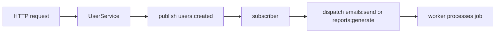

# Events versus Queues

Events and queues solve different problems.

Use events to publish typed facts that other code may react to. Use queues and jobs for named background work that needs worker lifecycle, retries, timeouts, and operational control.

## Default Recommendation

Use this rule:

| Need | Use |
| --- | --- |
| Something happened and subscribers may react | Event |
| Work must run outside the request path | Job on a queue |
| Work needs retries, timeout, queue selection, or workers | Job on a queue |
| Multiple independent handlers should react to one fact | Event |
| A recurring task should run on a schedule | Scheduler |

Use this process rule:

| Runtime Shape | Good Default |
| --- | --- |
| One local process | in-process events, `workerpool` queue |
| Split local API and worker | in-process events only for same-process reactions, SQLite queue for durable work |
| Multiple production hosts | transport-backed events when fan-out must cross processes, durable queue backend for jobs |
| Recurring work | scheduler dispatches a job when the work needs durability or retries |

Events announce facts. Jobs do work. Schedules decide when recurring work starts.

## Events

An Event is a typed fact that something happened.

Examples:

- `users.created`
- `reports.generated`
- `uploads.received`
- `billing.invoice_paid`

Generated event code lives in:

```text
internal/events
```

Create an event type from the generated App:

```bash
forj run make:event UserRegistered
```

Event backends are configured with:

```text
EVENTS_SUPPORTED_DRIVERS=inproc
EVENTS_DRIVER=inproc
EVENTS_INPROC_WORKERS=0
EVENTS_INPROC_BUFFER=1024
```

`inproc` is the local-first default. It is process-local and non-durable.

## Queues and Jobs

A Queue is an asynchronous work transport and execution system.

A Job is a named unit of queued work with a payload and registered handler.

Examples:

- `emails:send`
- `reports:generate`
- `notifications:deliver`
- `billing:reconcile`

Generated queue and job code lives in:

```text
internal/queues
internal/jobs
```

Start workers:

```bash
forj run worker
```

Queue drivers are configured with:

```text
QUEUE_SUPPORTED_DRIVERS=workerpool,redis
QUEUE_DRIVER=workerpool
QUEUE_NAME=default
QUEUE_WORKERS=30
QUEUE_SHUTDOWN_TIMEOUT=10s
```

Use `workerpool` or `sync` for local or simple execution. Use Redis, NATS, SQS, RabbitMQ, SQLite, Postgres, or MySQL when the work needs a shared backend.

## How They Work Together

Events and jobs can be composed.

A common pattern:

1. HTTP request creates a user.
2. App publishes `users.created`.
3. A subscriber dispatches `emails:send`.
4. `worker` processes the email job.

The event announces the fact. The job performs the durable background work.



## Scheduler

The Scheduler defines recurring work.

Schedules live in:

```text
internal/scheduler/scheduler_registry.go
```

Start the scheduler:

```bash
forj run scheduler
```

Schedules should have stable names and point to domain-owned methods or command work.

Good schedule names:

- `reports:daily`
- `monitor:poll`
- `cleanup:stale-sessions`

## Driver Support

Events and queues follow the same driver support model as other GoForj primitives.

Compile-time support:

```text
EVENTS_SUPPORTED_DRIVERS=inproc,redis
QUEUE_SUPPORTED_DRIVERS=workerpool,redis
```

Runtime selection:

```text
EVENTS_DRIVER=inproc
QUEUE_DRIVER=workerpool
QUEUE_CRITICAL_DRIVER=redis
```

After changing supported drivers or named resources, use the normal build path:

```bash
forj build
```

::: info Dev Loop
During `forj dev`, the generated build watcher normally runs `forj build` for you.
:::

Use focused generation only when you intentionally want to refresh these surfaces without a full build:

```bash
forj generate --events
forj generate --queue
```

## Operational Differences

Events:

- model facts
- support fan-out
- may be local or backed by transport drivers
- should not be the default retry mechanism
- should keep handlers explicit and observable

Queues and jobs:

- model work
- have worker lifecycle
- support queue selection
- are the right place for retries and timeouts
- need shutdown behavior and production worker process planning

Scheduler:

- models recurring work
- should use stable names
- should avoid anonymous callbacks for important production work
- should not become a business-logic bucket

## Common Mistakes

::: warning Common mistakes
- Do not use events as a substitute for durable background jobs.
- Do not put long-running work directly in an HTTP controller.
- Do not hide important job names behind anonymous functions.
- Do not make event subscribers silently swallow important failures.
- Do not assume in-process events are durable across processes.
:::

## Next Steps

- [Events](/async/events) covers typed events.
- [Event Subscribers](/async/event-subscribers) covers fan-out handlers.
- [Jobs](/async/jobs) covers job definitions.
- [Queues](/async/queues) and [Workers](/async/workers) cover queue execution.
- [Scheduler](/async/scheduler) covers recurring work.
- [Events](/events), [Queue](/queue), and [Scheduler](/scheduler) cover standalone package behavior.
