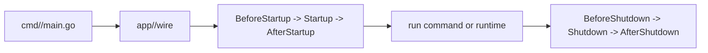

# Runtime Lifecycle

The runtime lifecycle is the ordered path from app construction to startup, command execution, runtime work, and graceful shutdown.

GoForj keeps this path explicit. Startup and shutdown behavior belongs in documented hooks, not package globals or hidden runtime registration.

## Start Here

Use lifecycle hooks when app behavior must run at startup or shutdown with injected dependencies.

Default app:

```text
app/lifecycle.go
```

Named app:

```text
app/marketplace/lifecycle.go
```

Do not use lifecycle hooks for ordinary request, job, schedule, command, or constructor work.

## Execution Flow

An app command follows this shape:

1. load environment configuration
2. initialize the app through its Wire graph
3. parse the selected command
4. start lifecycle phases
5. run the command or runtime
6. shut down with bounded timeouts



## Lifecycle Support

Reusable lifecycle machinery lives in:

```text
internal/runtime
```

Generated app metadata lives in:

```text
internal/runtime/apps.go
```

App owners should edit `app/lifecycle.go`, not `internal/runtime`.

## Register Hooks

Example:

```go
package app

type LifecycleRegistry struct {
	reports *reports.Service
}

func NewLifecycleRegistry(reports *reports.Service) *LifecycleRegistry {
	return &LifecycleRegistry{reports: reports}
}

func (r *LifecycleRegistry) Startup(ctx context.Context) error {
	return r.reports.WarmCache(ctx)
}

func (r *LifecycleRegistry) Shutdown(ctx context.Context) error {
	return r.reports.Flush(ctx)
}
```

`NewLifecycleRegistry` is built by Wire, so it can receive services and repositories.

## Runtime Boundaries

The lifecycle applies to generated commands, but commands do different work:

- `forj route:list` starts, lists routes, and shuts down.
- `forj api` starts the HTTP runtime and blocks.
- `forj worker` starts workers and blocks.
- `forj scheduler` starts scheduler work and blocks.
- `forj app` starts enabled runtimes together.

Named apps use the same shape:

```bash
forj marketplace api
forj marketplace worker
```

## Common Mistakes

::: warning Common mistakes
- Do not put startup behavior in `cmd/<app>/main.go`.
- Do not put app-specific startup behavior in `internal/runtime`.
- Do not make required dependencies appear optional.
- Do not start long-lived runtime work from constructors.
:::

## Next Steps

- [Runtime Topology](/core/runtime-topology) explains app and runtime process shapes.
- [Project Structure](/getting-started/project-structure) explains where runtime packages live.
