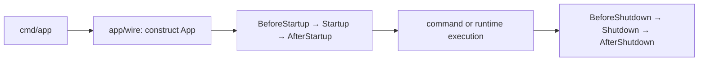

# Runtime Lifecycle

The Execution Lifecycle is the ordered path from App construction through runtime work to graceful shutdown. GoForj keeps it visible: Wire constructs the App, lifecycle hooks run at startup and shutdown, and a command owns its Runtime boundary.

## The Runtime Path


```mermaid
flowchart LR
  entry["cmd/app"] --> wire["app/wire: construct App"]
  wire --> start["BeforeStartup → Startup → AfterStartup"]
  start --> run["command or runtime execution"]
  run --> stop["BeforeShutdown → Shutdown → AfterShutdown"]
```

The generated `App.Run` starts the lifecycle before executing a parsed command and defers shutdown with the App shutdown timeout. Startup phases run in registration order. Shutdown phases run in reverse registration order, so dependent resources can stop before what they rely on.

## Add an App-Owned Hook

`app/lifecycle.go` is render-once and is the supported extension point. Wire can inject required dependencies into its constructor:

```go
package app

type LifecycleRegistry struct {
	reports *reports.Service
}

func NewLifecycleRegistry(reports *reports.Service) *LifecycleRegistry {
	return &LifecycleRegistry{reports: reports}
}

func (r *LifecycleRegistry) Register(lifecycle *runtime.Lifecycle) {
	lifecycle.On(runtime.BeforeStartup, r.BeforeStartup)
	lifecycle.On(runtime.Shutdown, r.Shutdown)
}

func (r *LifecycleRegistry) BeforeStartup(ctx context.Context) error {
	return r.reports.CheckPrerequisites(ctx)
}

func (r *LifecycleRegistry) Shutdown(ctx context.Context) error {
	return r.reports.Flush(ctx)
}
```

This is an illustrative fragment: retain the generated phase methods you do not change. Use `BeforeStartup` for prerequisite checks that must fail fast, `Startup` for App-owned process-lifetime resources, and shutdown phases to stop accepting work, flush, and release App-owned resources. Do not put ordinary request, job, or schedule behavior in hooks.

## Execute and Verify

After changing lifecycle wiring, build and run a bounded command:

```bash
forj build
go test ./...
forj route:list
```

Expected result: the build regenerates the Wire graph, tests pass, and `route:list` starts the App, prints registered routes, then runs shutdown. For a long-running HTTP Runtime, run `forj api`; stop it with `Ctrl+C` and confirm shutdown hooks complete within the configured timeout.

Runtime-capable built Apps use the standalone runtime when started with no arguments:

```bash
./bin/app
./bin/app run
```

Those commands are equivalent. Explicit runtime commands remain explicit: `./bin/app api`, `./bin/app worker`, and `./bin/app scheduler` each own a different process surface.

## Boundaries

`internal/runtime` owns reusable lifecycle coordination and App timeout policy. `app/lifecycle.go` owns App-specific hooks. HTTP, worker, and scheduler packages own their runtime behavior. Constructors and providers must not start long-lived work because construction can also happen for short-lived commands and tests.

## Common Mistakes

::: warning Common mistakes
- Do not put App-specific hooks in `internal/runtime` or `cmd/app/main.go`.
- Do not assume a constructor is a startup hook.
- Do not make required lifecycle dependencies optional to avoid a Wire failure.
- Do not treat `forj route:list` and `forj api` as the same runtime duration.
:::

## Next Steps

- [Runtime Topology](/core/runtime-topology) explains process shapes.
- [Dependency Injection](/core/dependency-injection) explains App construction.
