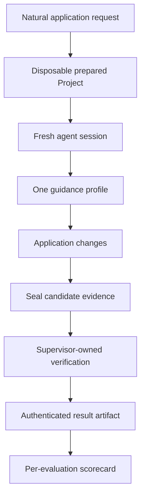

# Atlas Evaluation Program

Atlas evaluations measure whether a fresh coding agent can turn a natural application request into a correct, maintainable GoForj Project.

The program grades the application left behind, not whether the agent's explanation sounds convincing. Each attempt starts from a disposable Project, gives the agent one defined level of GoForj guidance, and verifies the resulting code outside the agent's own tests.

The latest complete scorecard covers 32 application evaluations across four guidance profiles. It contains 128 current result cells and is supported by 207 authenticated provider attempts, including targeted repeats used to investigate variance and correct verifier defects.

## Current State

| Property | Current Position |
| --- | --- |
| Latest complete scorecard | 32 evaluations across four guidance profiles |
| Current promoted portfolio | 33 evaluations; `create-data-resource` was added after the complete scorecard |
| Retained provider attempts | 207 in the latest complete benchmark corpus |
| Capability coverage | 41 of 57 named capabilities mapped to promoted evaluations |
| Agent and model in the latest complete scorecard | Codex 0.147.0 with `openai/gpt-5.6-sol` |
| Execution backend | `unconfined-local`, suitable for diagnostics but not release qualification |
| Latest complete measurement window | August 19, 2026, 13:07 to 18:35 UTC |

The [maintainer benchmark](https://github.com/goforj/goforj/blob/main/docs/maintainer/atlas-evaluation-benchmark.md) is the detailed source of truth for exact revisions, retained cohorts, contract corrections, and future scorecard updates.

## The Question Being Measured

The program asks:

> Can a fresh agent take a realistic GoForj application request, discover the intended workflow, and leave behind working code that respects the Framework's boundaries?

This is deliberately different from asking whether a model can answer a GoForj question. Application work requires the agent to navigate generators, package ownership, Wire registration, runtime behavior, context propagation, tests, and generated files together.

A successful attempt must provide the requested behavior. Preferred command use and framework conventions are measured separately, so invoking the expected generator cannot make broken code pass.

## Evaluation Flow

Every treatment receives an independent writable copy of equivalent prepared state. Agent sessions are fresh and do not resume earlier conversations. The runner records the exact agent, model, Atlas version, GoForj revision, evaluation catalog, backend, and executable identities used for the attempt.

### Repository Responsibilities

The evaluation boundary spans two repositories without duplicating ownership:

| Repository | Responsibility |
| --- | --- |
| GoForj | Defines realistic scenario state, renders and prepares disposable Projects, provides reviewed target implementations, calibrates Framework behavior, and exposes the thin `forj atlas:eval` command. |
| Atlas | Defines evaluation manifests and guidance profiles, runs fresh agent sessions, captures evidence, applies independent verifiers, authenticates retained artifacts, and produces comparisons and reports. |

GoForj owns what a valid application workflow means. Atlas owns how an independent agent attempt is executed and measured.

### Portfolio Organization

Evaluations are organized along two independent dimensions:

| Dimension | Values | Purpose |
| --- | --- | --- |
| Task kind | Scaffold, feature, repair, abstention, and runtime observability | Distinguishes the kind of application work being measured. |
| Tier | Smoke, core, and extended | Controls evaluation cost while keeping release-critical behavior available in the smallest portfolio. |

Tiers are cumulative. Smoke contains the fastest release-critical signal, core adds representative Framework behavior, and extended is reserved for specialized or expensive coverage.

## Guidance Profiles

The four profiles form a cumulative treatment ladder:

| Profile | Project Instructions | Recommended Skills | Atlas MCP |
| --- | :---: | :---: | :---: |
| `none` | No GoForj-specific instructions | No | No |
| `agents` | Yes | No | No |
| `agents-skills` | Yes | Yes | No |
| `atlas` | Yes | Yes | Yes |

Adjacent comparisons isolate the contribution of one layer:

- `none` versus `agents` measures baseline Project instructions.
- `agents` versus `agents-skills` measures recommended workflow skills.
- `agents-skills` versus `atlas` measures Atlas MCP availability on top of written guidance.
- `none` versus `atlas` measures the complete experience, not an individual layer.

The profile records what was available. It does not claim the agent used every available tool.

## What the Verifier Checks

Atlas and GoForj divide verification into evidence that answers different questions.

| Evidence | What It Establishes |
| --- | --- |
| Application outcome | The resulting Project provides the requested behavior. |
| Change ownership | The agent changed the intended application files without rewriting unrelated generated or App-owned code. |
| Structural contract | Required types, methods, configuration, context flow, and package boundaries exist in a valid Go design. |
| Framework registration | Routes, Wire providers, commands, jobs, schedules, subscribers, resources, and additional apps are connected where the Runtime can discover them. |
| Build and framework commands | The Project compiles, its tests pass, generated wiring remains valid, and inspection commands expose the expected result. |
| Supervisor-owned behavior probe | Independent tests exercise behavior such as transaction rollback, cache hits, queue dispatch, conditional HTTP responses, or cancellation propagation. |
| Workflow conformance | Generator and tool usage are measured separately from correctness. |
| Quality observation | Tasks that warrant regression coverage report whether the agent added a focused test. |

Candidate-authored tests are retained as a maintainability signal, but they cannot approve the candidate's own implementation. Behavior-sensitive evaluations use verifier-owned probes installed after the candidate tree is sealed.

Each promoted verifier is calibrated against a reviewed golden Project and at least one targeted mutant. Compiling semantic mutants are used when source structure and compilation alone cannot distinguish correct behavior from a plausible defect.

## What the Portfolio Covers

The complete scorecard evaluates practical application work rather than isolated documentation recall.

### Framework Generation and Composition

| Evaluation | Application Task |
| --- | --- |
| `add-app-command` | Add `invoices:show` around existing invoice behavior. |
| `add-event-subscriber` | React to a typed invoice-paid event. |
| `add-http-controller` | Add an invoice HTTP endpoint. |
| `add-job` | Queue typed receipt work. |
| `add-migration` | Add invoice status storage. |
| `add-named-app-route` | Add an audit route to an additional app. |
| `add-named-cache` | Configure and use a profiles cache. |
| `add-named-resource` | Configure and use a reports queue. |
| `add-named-storage` | Configure and use avatar storage. |
| `add-schedule` | Reconcile invoices hourly. |
| `create-additional-app` | Add a separately runnable status page app. |
| `create-model` | Build a model and repository from a database table. |
| `model-relationships` | Model users and posts without leaking persistence into delivery code. |

### Application Behavior and Boundaries

| Evaluation | Application Task |
| --- | --- |
| `add-cached-repository` | Add cache-aside behavior behind a repository boundary. |
| `add-database-transaction` | Transfer funds atomically with rollback behavior. |
| `add-mail-workflow` | Send an invoice-derived receipt through the generated mail manager. |
| `add-outbound-http-integration` | Fetch a typed tax rate with caller cancellation. |
| `add-route-middleware` | Protect an invoice route with application-owned middleware. |
| `add-upload-workflow` | Validate and persist an upload through named storage. |
| `add-validated-write-endpoint` | Create invoices through a stable validation and error contract. |
| `build-json-api-feature` | Build a complete user lookup feature across HTTP, services, and persistence. |
| `choose-storage-for-files` | Recognize that durable attachments belong behind named storage. |
| `protect-route-with-auth` | Move invoice routes behind the generated Auth route boundary. |
| `publish-domain-event` | Publish and handle a typed user-created event. |
| `serve-cacheable-image` | Serve stored avatars with cache headers and ETag revalidation. |

### Lifecycle, Resilience, Operations, and Judgment

| Evaluation | Application Task |
| --- | --- |
| `add-app-lifecycle-hook` | Add an application readiness check. |
| `add-resilient-job` | Generate reports with retry, timeout, cancellation, and idempotency policy. |
| `dispatch-event-followup-job` | Convert an event reaction into durable typed job work. |
| `repair-wire-provider` | Repair a missing provider with the smallest Wire change. |
| `runtime-observability` | Restore local Lighthouse capture without damaging metrics or inspect behavior. |
| `schedule-existing-job` | Discover targets and dispatch existing report work daily. |
| `unknown-framework-shape` | Ask for a missing architectural decision instead of inventing a framework feature. |

After this matrix was recorded, `create-data-resource` became the thirty-third promoted evaluation. It measures whether an agent applies a migration and derives a model and repository through the established generator workflow instead of hand-authoring persistence types. One fresh Atlas-profile attempt passed, but its temporary evidence was not retained, so it is correctly excluded from the complete scorecard.

## Latest Complete Result

| Guidance Profile | Passed | Failed | Evaluations | Pass Rate |
| --- | ---: | ---: | ---: | ---: |
| No framework guidance | 25 | 7 | 32 | 78.1% |
| `AGENTS.md` | 29 | 3 | 32 | 90.6% |
| `AGENTS.md` and recommended skills | 31 | 1 | 32 | 96.9% |
| `AGENTS.md`, skills, and Atlas MCP | 31 | 1 | 32 | 96.9% |

The measured snapshot observed a 12.5-point increase from no guidance to `AGENTS.md`, followed by another 6.3 points when recommended skills were present. Atlas MCP availability produced no additional aggregate pass-rate change in this run.

These are observed differences, not causal estimates. Most cells contain one attempt, and the scorecard was assembled from exact revision cohorts while verifier defects were corrected. Repeated paired trials are required before treating these percentages as reliability estimates.

### Measurement Identity

The latest complete scorecard is a rolling calibrated snapshot, not one monolithic execution. Corrected cells were rerun against exact revision cohorts, while superseded and invalid evidence remained retained for diagnosis.

| Property | Recorded Value |
| --- | --- |
| Measured | August 19, 2026, 13:07 to 18:35 UTC |
| Evaluations | 32 |
| Current matrix cells | 128 |
| Retained attempts | 207 authenticated provider sessions |
| Agent | Codex 0.147.0 |
| Model | `openai/gpt-5.6-sol` |
| Backend | `unconfined-local` |
| GoForj cohorts | `cdea5dee`, `9479bd8d`, `7dd45481`, `3bae5261`, and `fb8c3db3` |
| Atlas verifier cohorts | `v0.4.7`, `v0.4.8`, `v0.4.9`, `v0.4.11`, and `v0.4.12` |
| Final corrected runner | GoForj `fb8c3db3` with Atlas `v0.4.12` |

Attempts were admitted by recorded identity, not by directory name or an optimistic binary label. Two attempted reruns were excluded because their manifests revealed a stale Atlas module despite the newer commit identity reported by the runner.

## Results by Evaluation

| Evaluation | No Guidance | `AGENTS.md` | Skills | Atlas |
| --- | :---: | :---: | :---: | :---: |
| `add-app-command` | Pass | Pass | Pass | Pass |
| `add-app-lifecycle-hook` | Pass | Pass | Pass | Pass |
| `add-cached-repository` | Pass | Pass | Pass | Pass |
| `add-database-transaction` | Pass | Fail | Pass | Pass |
| `add-event-subscriber` | Fail | Pass | Pass | Pass |
| `add-http-controller` | Pass | Pass | Pass | Pass |
| `add-job` | Fail | Pass | Pass | Pass |
| `add-mail-workflow` | Fail | Pass | Pass | Pass |
| `add-migration` | Pass | Pass | Pass | Pass |
| `add-named-app-route` | Pass | Pass | Pass | Pass |
| `add-named-cache` | Pass | Pass | Pass | Pass |
| `add-named-resource` | Pass | Pass | Pass | Pass |
| `add-named-storage` | Pass | Pass | Pass | Pass |
| `add-outbound-http-integration` | Pass | Pass | Pass | Pass |
| `add-resilient-job` | Fail | Pass | Pass | Pass |
| `add-route-middleware` | Fail | Pass | Pass | Pass |
| `add-schedule` | Pass | Pass | Pass | Pass |
| `add-upload-workflow` | Pass | Pass | Pass | Pass |
| `add-validated-write-endpoint` | Pass | Pass | Pass | Pass |
| `build-json-api-feature` | Pass | Pass | Pass | Pass |
| `choose-storage-for-files` | Pass | Pass | Pass | Pass |
| `create-additional-app` | Pass | Pass | Pass | Pass |
| `create-model` | Pass | Pass | Pass | Pass |
| `dispatch-event-followup-job` | Pass | Pass | Pass | Pass |
| `model-relationships` | Pass | Pass | Pass | Pass |
| `protect-route-with-auth` | Pass | Pass | Pass | Pass |
| `publish-domain-event` | Fail | Fail | Fail | Fail |
| `repair-wire-provider` | Fail | Pass | Pass | Pass |
| `runtime-observability` | Pass | Fail | Pass | Pass |
| `schedule-existing-job` | Pass | Pass | Pass | Pass |
| `serve-cacheable-image` | Pass | Pass | Pass | Pass |
| `unknown-framework-shape` | Pass | Pass | Pass | Pass |

The remaining guided failure was `publish-domain-event`. Agents generated the event correctly but did not consistently update an existing service test after adding a request context to the service signature. The Project therefore failed to compile. The failure remains visible as product and guidance feedback instead of being rerun until it turns green.

## Maintainability Signal

Thirteen evaluations required the agent to add a focused regression test. This is reported separately because correct behavior and maintainable test coverage are related but distinct outcomes.

| Guidance Profile | Added Focused Test | Missing Focused Test | Measured |
| --- | ---: | ---: | ---: |
| No framework guidance | 9 | 4 | 13 |
| `AGENTS.md` | 11 | 2 | 13 |
| `AGENTS.md` and recommended skills | 12 | 1 | 13 |
| `AGENTS.md`, skills, and Atlas MCP | 11 | 2 | 13 |

The Atlas profile made 137 MCP calls across 17 of its 43 retained attempts. The other 26 Atlas attempts completed without an MCP call. The Atlas profile therefore measures MCP availability, not proof that MCP caused an outcome.

## Variance and Verifier Corrections

Seven result cells produced both a pass and a failure under the same verifier release. The affected work included cached repositories, transactions, event subscribers, named resources, validated writes, and model creation. This confirms that one attempt per cell provides broad coverage but not a stable reliability estimate.

Live trials also exposed defects in the evaluation system itself. Corrections removed implementation-name overfitting, aligned probes with current generator output, fixed source-ownership boundaries, removed stale imports, and repaired behavior-probe setup. A failed verifier is treated as evidence to investigate, not as a reason to select a more favorable attempt.

Every included attempt in the complete scorecard was authenticated before aggregation. Attempts with stale module identities were excluded even when their binaries carried a newer commit stamp.

## Trust Boundary

The current backend is intentionally described as diagnostic.

It can prepare Projects, run fresh sessions, retain changes, execute independent verification, and authenticate stored artifacts. It cannot provide an adversarial guarantee that candidate code was unable to inspect sibling processes, credentials, verifier state, or the artifact key while running under the same host user.

For that reason, the current scorecard is not a release gate. Command use, filesystem containment, credential isolation, and complete process cleanup remain ineligible for authoritative claims until a container or VM backend passes negative isolation tests.

## Capability Coverage

The capability catalog names important Framework behavior independently of the number of evaluation prompts. At the current checkpoint, 41 of 57 capabilities map to promoted evaluations and 16 remain planned.

Planned work includes structured results, worker failure behavior, driver swaps, multiple database connections, frontend workflows, OAuth, rate limiting, session boundaries, deployment, backups, runtime configuration, graceful shutdown, and maintenance mode.

Capabilities remain planned when the only available verifier would search for source tokens. The program prefers fewer behaviorally meaningful evaluations over a larger but weaker scenario count.

## What Comes Next

The next architectural step is an authoritative container or VM backend with negative tests for filesystem, credential, network, process, and verifier isolation.

The next measurement step is repeated paired trials over a smaller sentinel portfolio. That work will estimate variance and compare adjacent guidance profiles without paying for a complete matrix on every change.

The next product step is to classify failures by their smallest responsible owner: Framework API, generator behavior, command ergonomics, documentation, Project instructions, skills, MCP discovery, or verifier defect. The evaluation program succeeds when those findings make GoForj simpler to use, not when the number of evaluations grows.

## Further Reading

- [Atlas](/developer-tools/atlas) explains the user-facing guidance, skills, and MCP experience.
- [The current benchmark](https://github.com/goforj/goforj/blob/main/docs/maintainer/atlas-evaluation-benchmark.md) records the detailed scorecard and measurement identity.
- [The evaluation program plan](https://github.com/goforj/atlas/blob/main/docs/live-agent-evaluation-plan.md) records the implementation, trust model, and maintainer handoff.
- [The original GoForj evaluation PR](https://github.com/goforj/goforj/pull/70) explains Project preparation, scenarios, and framework verification.
- [The original Atlas evaluation PR](https://github.com/goforj/atlas/pull/6) explains the runner, evidence, and verification engine.
- [The four-profile scorecard PR](https://github.com/goforj/goforj/pull/97) explains the latest complete published measurement.
