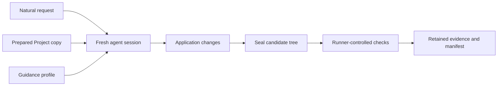

# Atlas Evaluation Program

GoForj gives application code explicit places to live, explicit ways to register, and executable ways to verify the assembled Project. GoForj also supplies baseline Project instructions. Atlas adds focused workflow skills and MCP tools that coding agents can use inside the Project.

The Atlas evaluation program asks one practical question:

> Can a fresh agent take a GoForj application request, discover the intended workflow, and leave behind code that passes task-specific acceptance checks?

The program grades the Project left behind, not whether the agent's explanation sounds convincing. Preferred generator and command use are reported separately, so following the expected workflow cannot make failed application checks pass.

## August 19, 2026 Rolling Diagnostic Scorecard

In this snapshot, GoForj baseline instructions were available in runs that passed 28 of 31 application contracts, compared with 24 of 31 without GoForj-specific guidance. Adding Atlas skills increased the selected count to 30 of 31. Adding MCP produced no further aggregate change, so this snapshot does not establish incremental MCP value. Every profile also passed a separate safe-abstention calibration.

| Guidance Profile | Selected Application Contracts Passed | Contracts with Failed Checks |
| --- | ---: | ---: |
| No GoForj-specific guidance (`none`) | 24/31 | 7 |
| GoForj baseline instructions (`agents`) | 28/31 | 3 |
| Baseline plus Atlas skills (`agents-skills`) | 30/31 | 1 |
| Baseline plus Atlas skills and MCP (`atlas`) | 30/31 | 1 |

In this page, `Pass` is shorthand for a selected task-profile result in which no eligible diagnostic check failed. It is not an authoritative Framework or contract pass; those formal outcomes remain `ineligible` on the current backend.

The scorecard assembles the latest accepted result for each task and profile across exact revision cohorts. It is not one randomized four-profile run. The published snapshot contains 31 application tasks plus one calibration task, each evaluated under four profiles, for 128 selected task-profile results. The retained corpus contains 207 agent sessions because repeats, corrected contracts, and superseded attempts remain available for diagnosis. One additional application task was promoted after this snapshot.

These results are descriptive. Most task-profile combinations contain one attempt, the profile order was fixed, and the local backend lacks trusted isolation. The fractions are not reliability estimates, causal evidence, or release qualification.

Tasks are weighted equally. Each fraction describes selected contract coverage, not the probability that a future task will succeed.

### What This Evidence Supports

The snapshot supports a narrow product conclusion: GoForj baseline instructions and Atlas workflow skills were available in runs that satisfied more of this public GoForj conformance portfolio than runs without GoForj-specific guidance.

It does not establish incremental MCP value, general agent reliability, or a productivity improvement. The program does not yet measure completion time, token cost, review effort, diff quality, or long-term maintainability.

## Observed Patterns

Six tasks that failed without GoForj-specific guidance passed with the full Atlas setup: event subscribers, jobs, mail workflows, resilient jobs, route middleware, and Wire repair. Their prompts concern Framework-specific registration, lifecycle, or ownership boundaries that are not conveyed by Go knowledge alone. The snapshot does not establish that those boundaries or a particular guidance layer caused the differences.

Two intermediate results were non-monotonic. Database transactions and runtime observability passed with no guidance, failed with project instructions, then passed when skills were available. One task, publishing a domain event, failed in every profile because the agent changed a service signature without consistently updating an existing test caller.

| Task with Any Failed Check | No Guidance | GoForj Instructions | Plus Atlas Skills | Plus Atlas Skills and MCP |
| --- | :---: | :---: | :---: | :---: |
| `add-database-transaction` | Pass | Fail | Pass | Pass |
| `add-event-subscriber` | Fail | Pass | Pass | Pass |
| `add-job` | Fail | Pass | Pass | Pass |
| `add-mail-workflow` | Fail | Pass | Pass | Pass |
| `add-resilient-job` | Fail | Pass | Pass | Pass |
| `add-route-middleware` | Fail | Pass | Pass | Pass |
| `publish-domain-event` | Fail | Fail | Fail | Fail |
| `repair-wire-provider` | Fail | Pass | Pass | Pass |
| `runtime-observability` | Pass | Fail | Pass | Pass |

The other 22 application tasks passed their declared checks under every profile. The `unknown-framework-shape` calibration also passed under every profile by asking for a missing architectural decision instead of inventing Framework behavior.

GoForj makes application intent inspectable and executable. Generators place new code, App-local Wire sets expose registration, typed APIs define routes, jobs, events, and schedules, and Framework commands verify the assembled application. The evaluation tests whether agents can preserve that structure during cross-cutting work, not whether they can repeat documentation or produce a plausible code sample.

GoForj supplies the baseline instructions during Project creation. To add the workflow skills and optional MCP connection represented by the later profiles, [install Atlas](/developer-tools/atlas#install-and-verify).

## How an Evaluation Works

Every profile run receives an independent writable copy of equivalent prepared state. Agent sessions are fresh and do not resume earlier conversations. The runner records the agent, model, Atlas version, GoForj revision, evaluation catalog, backend, and executable identities used for the attempt.

### Repository Responsibilities

The evaluation boundary spans two repositories without duplicating ownership:

| Repository | Responsibility |
| --- | --- |
| GoForj | Defines scenario state, renders and prepares disposable Projects, provides maintainer-reviewed reference implementations, calibrates Framework behavior, and exposes the thin `forj atlas:eval` command. |
| Atlas | Defines evaluation manifests and guidance profiles, runs fresh agent sessions, captures evidence, applies runner-controlled checks, verifies retained artifact manifests, and produces comparisons and reports. |

GoForj owns what a valid application workflow means. Atlas owns how an agent attempt is executed and measured.

### Guidance Profiles

The profiles are cumulative. The identifiers in parentheses are the names used by the evaluation runner.

| Profile | GoForj Instructions | Atlas Skills | Atlas MCP |
| --- | :---: | :---: | :---: |
| No GoForj-specific guidance (`none`) | No | No | No |
| GoForj baseline instructions (`agents`) | Yes | No | No |
| Baseline plus Atlas skills (`agents-skills`) | Yes | Yes | No |
| Baseline plus Atlas skills and MCP (`atlas`) | Yes | Yes | Yes |

MCP is the Model Context Protocol connection through which Atlas exposes focused documentation and local Project information. The ladder is designed so adjacent profiles differ by one available guidance layer. This snapshot describes those comparisons, but repeated randomized trials are needed to estimate the effect of an individual layer.

### Acceptance Evidence

Each task has a declared set of acceptance checks. Feature tasks generally include behavior probes, while some scaffold tasks establish source structure, registration, generated parity, command visibility, and compilation.

| Evidence | What It Establishes |
| --- | --- |
| Application checks | The resulting Project satisfies the task's declared requirements. |
| Change ownership | The agent changed the intended application files without rewriting unrelated generated or App-owned code. |
| Structural checks | Required types, methods, configuration, context flow, and package boundaries exist in an accepted Go design. |
| Framework registration | Routes, Wire providers, commands, jobs, schedules, subscribers, resources, and additional apps are connected where the Runtime can discover them. |
| Build and inspection commands | Candidate production code passes restored pre-agent tests and verifier-owned probes, generated wiring remains valid, and Framework commands expose the expected result. |
| Workflow conformance | Generator and command use are reported separately from application correctness. |

Candidate-authored tests are excluded from verifier execution. They cannot approve the candidate's own implementation. Behavior-sensitive evaluations use private verifier-owned probes after the candidate tree has been sealed.

Every promoted verifier is calibrated against a maintainer-reviewed reference Project and at least one deliberately flawed implementation. Compiling flaws are used when source structure and compilation alone cannot distinguish correct behavior from a plausible defect.

## Secondary Observations

Thirteen tasks asked the agent to add focused regression coverage. The evaluation detects whether the candidate added or modified a matching file containing a parseable Go test function. It does not execute that candidate-authored test or establish its assertions, coverage, or correctness.

| Guidance Profile | Parseable Test Function Observed | Missing Observation | Measured |
| --- | ---: | ---: | ---: |
| No GoForj-specific guidance | 9 | 4 | 13 |
| GoForj baseline instructions | 11 | 2 | 13 |
| Baseline plus Atlas skills | 12 | 1 | 13 |
| Baseline plus Atlas skills and MCP | 11 | 2 | 13 |

Codex adapter telemetry reported 137 MCP calls across 17 of 43 retained full-Atlas attempts. The other 26 completed without a reported MCP call. These totals include repeated and superseded attempts, not only the selected scorecard results. The skills-only and full-Atlas profiles had equal aggregate diagnostic scores, so this snapshot cannot estimate MCP's effect.

## Limits of This Snapshot

### Sampling and Representativeness

The portfolio is a curated, public GoForj conformance suite. Guidance authors can inspect its prompts and contracts. It is not a representative sample of application development and does not include a guidance-blind holdout set.

The snapshot covers Codex 0.147.0 with `openai/gpt-5.6-sol`. It does not compare GoForj with other frameworks, compare coding agents, or establish results for other model versions.

### Trial Count, Order, and Variance

Most displayed task-profile results select one attempt. Seven results produced both a pass and a failure under the same verifier release. Paired profiles ran in fixed control-then-treatment order, so order and time drift may be confounded with guidance availability.

For each displayed result, the scorecard selected the latest chronological attempt using the corrected contract. Repeated outcomes remain retained for diagnosis but are not combined into the displayed rate. The public scorecard does not map every selected result to its attempt ID and exact verifier revision, and the retained attempt artifacts are not published by this page. That limits independent reconstruction from the public record alone.

Future treatment measurements need repeated, randomized, time-interleaved pairs under a declared analysis protocol.

### Backend Isolation and Evidence Integrity

Every underlying run has formal evaluation status `diagnostic` and authoritative Framework outcome `ineligible`. The `unconfined-local` backend can prepare Projects, run fresh sessions, retain changes, and execute verifier-owned checks, but candidate and runner processes share the host user.

Atlas uses a keyed hash, or HMAC, to check retained artifact manifests for post-run changes. This provides diagnostic tamper evidence, not adversarial authentication, because a candidate process may reach signing authority or retained files on the current backend.

Command use, host-filesystem containment, credential isolation, network enforcement, process cleanup, verifier isolation, and artifact isolation remain ineligible for authoritative claims until a container or VM backend passes negative isolation tests.

## Current Coverage and Next Work

The latest complete scorecard contains 31 application tasks and one safe-abstention calibration across four profiles. `create-data-resource` was promoted afterward as the thirty-second application task and will enter a published scorecard only after a retained comparison cohort is complete.

In Atlas `v0.4.13`, 40 of 57 named capabilities map to promoted evaluations and 17 remain planned. Planned work includes structured results, worker failure behavior, driver swaps, multiple database connections, frontend workflows, OAuth, rate limiting, session boundaries, deployment, backups, runtime configuration, graceful shutdown, and maintenance mode.

Capabilities remain planned when the only available verifier would search for source tokens. The program prefers fewer behaviorally meaningful evaluations over a larger but weaker count.

The next architectural step is an authoritative container or VM backend with runner-controlled command capture and negative tests for host-filesystem, credential, network, process-cleanup, verifier, and artifact isolation. The next measurement step is a smaller sentinel portfolio with repeated, randomized, time-interleaved pairs and a machine-readable manifest that maps each published result to its attempt and verifier identity. The next product step is to classify failures by their responsible owner and use that evidence to make GoForj simpler.

## Complete Portfolio and Scorecard

The sections below preserve the detailed public record without making it part of the primary reading path.

<strong>All 31 application tasks</strong>

| Evaluation | Application Task |
| --- | --- |
| `add-app-command` | Add `invoices:show` around existing invoice behavior. |
| `add-app-lifecycle-hook` | Add an application readiness check. |
| `add-cached-repository` | Add cache-aside behavior behind a repository boundary. |
| `add-database-transaction` | Transfer funds atomically with rollback behavior. |
| `add-event-subscriber` | React to a typed invoice-paid event. |
| `add-http-controller` | Add an invoice HTTP endpoint. |
| `add-job` | Queue typed receipt work. |
| `add-mail-workflow` | Send an invoice-derived receipt through the generated mail manager. |
| `add-migration` | Add invoice status storage. |
| `add-named-app-route` | Add an audit route to an additional app. |
| `add-named-cache` | Configure and use a profiles cache. |
| `add-named-resource` | Configure and use a reports queue. |
| `add-named-storage` | Configure and use avatar storage. |
| `add-outbound-http-integration` | Fetch a typed tax rate with caller cancellation. |
| `add-resilient-job` | Generate reports with retry, timeout, cancellation, and idempotency policy. |
| `add-route-middleware` | Protect an invoice route with application-owned middleware. |
| `add-schedule` | Reconcile invoices hourly. |
| `add-upload-workflow` | Validate and persist an upload through named storage. |
| `add-validated-write-endpoint` | Create invoices through a stable validation and error contract. |
| `build-json-api-feature` | Build a complete user lookup feature across HTTP, services, and persistence. |
| `choose-storage-for-files` | Recognize that durable attachments belong behind named storage. |
| `create-additional-app` | Add a separately runnable status page app. |
| `create-model` | Build a model and repository from a database table. |
| `dispatch-event-followup-job` | Convert an event reaction into durable typed job work. |
| `model-relationships` | Model users and posts without leaking persistence into delivery code. |
| `protect-route-with-auth` | Move invoice routes behind the generated Auth route boundary. |
| `publish-domain-event` | Publish and handle a typed user-created event. |
| `repair-wire-provider` | Repair a missing provider with the smallest Wire change. |
| `runtime-observability` | Restore local Lighthouse capture without damaging metrics or inspect behavior. |
| `schedule-existing-job` | Discover targets and dispatch existing report work daily. |
| `serve-cacheable-image` | Serve stored avatars with cache headers and ETag revalidation. |

<strong>All 128 selected task-profile results</strong>

| Evaluation | No Guidance | GoForj Instructions | Plus Atlas Skills | Plus Atlas Skills and MCP |
| --- | :---: | :---: | :---: | :---: |
| `add-app-command` | Pass | Pass | Pass | Pass |
| `add-app-lifecycle-hook` | Pass | Pass | Pass | Pass |
| `add-cached-repository` | Pass | Pass | Pass | Pass |
| `add-database-transaction` | Pass | Fail | Pass | Pass |
| `add-event-subscriber` | Fail | Pass | Pass | Pass |
| `add-http-controller` | Pass | Pass | Pass | Pass |
| `add-job` | Fail | Pass | Pass | Pass |
| `add-mail-workflow` | Fail | Pass | Pass | Pass |
| `add-migration` | Pass | Pass | Pass | Pass |
| `add-named-app-route` | Pass | Pass | Pass | Pass |
| `add-named-cache` | Pass | Pass | Pass | Pass |
| `add-named-resource` | Pass | Pass | Pass | Pass |
| `add-named-storage` | Pass | Pass | Pass | Pass |
| `add-outbound-http-integration` | Pass | Pass | Pass | Pass |
| `add-resilient-job` | Fail | Pass | Pass | Pass |
| `add-route-middleware` | Fail | Pass | Pass | Pass |
| `add-schedule` | Pass | Pass | Pass | Pass |
| `add-upload-workflow` | Pass | Pass | Pass | Pass |
| `add-validated-write-endpoint` | Pass | Pass | Pass | Pass |
| `build-json-api-feature` | Pass | Pass | Pass | Pass |
| `choose-storage-for-files` | Pass | Pass | Pass | Pass |
| `create-additional-app` | Pass | Pass | Pass | Pass |
| `create-model` | Pass | Pass | Pass | Pass |
| `dispatch-event-followup-job` | Pass | Pass | Pass | Pass |
| `model-relationships` | Pass | Pass | Pass | Pass |
| `protect-route-with-auth` | Pass | Pass | Pass | Pass |
| `publish-domain-event` | Fail | Fail | Fail | Fail |
| `repair-wire-provider` | Fail | Pass | Pass | Pass |
| `runtime-observability` | Pass | Fail | Pass | Pass |
| `schedule-existing-job` | Pass | Pass | Pass | Pass |
| `serve-cacheable-image` | Pass | Pass | Pass | Pass |
| `unknown-framework-shape` | Pass | Pass | Pass | Pass |

<strong>Measurement identity</strong>

| Property | Recorded Value |
| --- | --- |
| Measured | August 19, 2026, 13:07 to 18:35 UTC |
| Selected results | 128 |
| Retained attempts | 207 artifact sets whose manifests passed HMAC verification |
| Agent | Codex 0.147.0 |
| Model | `openai/gpt-5.6-sol` |
| Backend | `unconfined-local` |
| GoForj cohorts | `cdea5dee`, `9479bd8d`, `7dd45481`, `3bae5261`, and `fb8c3db3` |
| Atlas verifier cohorts | `v0.4.7`, `v0.4.8`, `v0.4.9`, `v0.4.11`, and `v0.4.12` |
| Final corrected runner | GoForj `fb8c3db3` with Atlas `v0.4.12` |
| Runner binary | `sha256:cb771c3b237eeef1447ce2f548b44bdbdde90cec06e8d6ad49aa89f14641c62e` |
| Evaluation catalog | `sha256:df0a33b539e9e2cc4ac37f426d1647ff4e975b5bf2d85f8b04503928ea4a5ebf` |
| Agent binary | `sha256:7c16f9159aa8cf388d375cfd3150fed4dbc331c56cbdf16947fefbcdd8a5c43c` |

Two attempted reruns were excluded because their manifests revealed a stale Atlas module despite the newer commit identity reported by the runner. Live trials also exposed verifier defects, including implementation-name overfitting, stale imports, incorrect source-ownership boundaries, and behavior-probe setup errors. Corrected contracts were rerun only for affected profiles.

## Further Reading

- [Atlas](/developer-tools/atlas) explains installation, project instructions, skills, and MCP context.
- [The recorded benchmark](https://github.com/goforj/goforj/blob/03cd5f6355f28cf1cfb2b7a9d9ff412824536e73/docs/maintainer/atlas-evaluation-benchmark.md) records the detailed 32-evaluation scorecard and its exact measurement identity.
- [The evaluation program plan](https://github.com/goforj/atlas/blob/main/docs/live-agent-evaluation-plan.md) records implementation ownership, validation, and the trust model.
