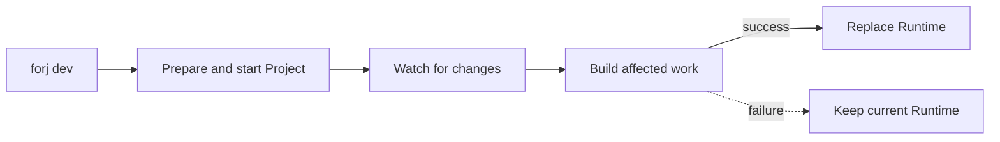
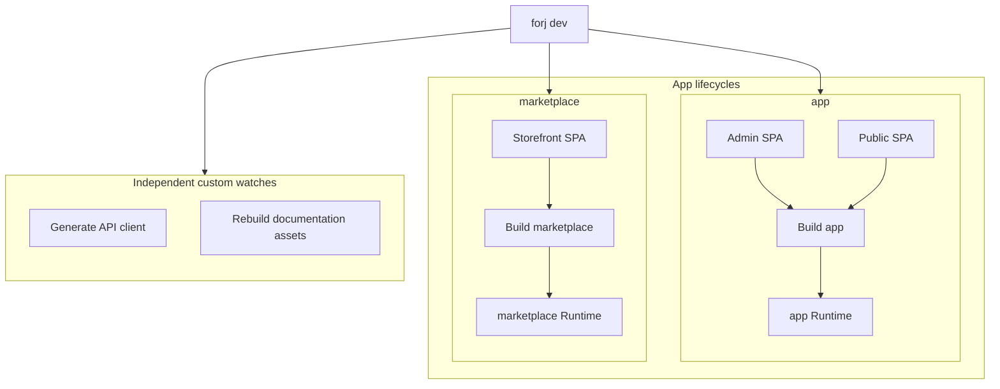
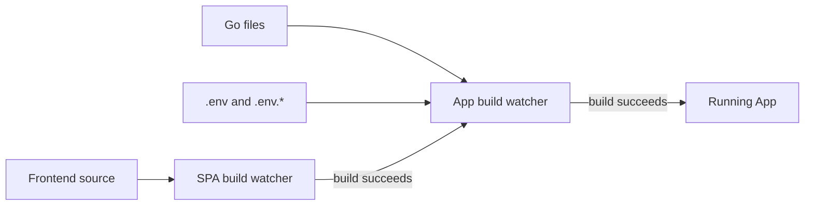

# Local Development with `forj dev`

Start the Project's complete development loop with one command:

```bash
forj dev
```

The loop repeats after every change. Only a successful build replaces the running App.



In a GoForj Project, this can bring up local dependencies, prepare the database, build the frontend, compile the App, start its Runtime, and watch the files that feed each step. You do not need to keep separate build, frontend, and server commands synchronized in different terminals.

When a file changes, `forj dev` reruns only the affected work. It replaces the running App after a successful build. If the build fails, the last working Runtime stays up while the error remains visible in the transcript. Fix the error, save again, and the loop continues.

## Start the Development Loop

Run `forj dev` from the Project root. New Projects already include a working `dev` configuration in `.goforj.yml`.

After startup reconciliation, `forj dev` prints the ready summary and remains attached to the development transcript.

From that one session you can:

- follow setup, build, and Runtime output in order
- rebuild Go code and replace the running binary
- rebuild an App-owned SPA before rebuilding its App
- manage several Apps without mixing their lifecycle output
- restart work or run a Project command from the interactive controls
- stop configured local dependencies when the session exits

Press `?` during an interactive session to see the available controls.

Use `forj run <command>` when you need to execute one App command once. Use `forj dev` when GoForj should keep the Project running and own the feedback loop.

## What Happens When You Save

An App lifecycle is more than a file watcher. It understands which build produced the running binary and does not replace that binary until its successor is ready.

| Change | Work before Runtime replacement |
| --- | --- |
| Go source or environment | Build the App. |
| SPA source | Build the SPA, then build the App that serves it. |
| Failed build | Show the error and keep the current Runtime. |

Failed work stops at the failing step. A broken frontend build does not trigger an App build, and a broken App build does not take down the healthy Runtime you were already using.

The transcript keeps the failed command beside its output, so the development session remains useful even when several Apps and watchers are active.

## What `forj dev` Owns

The `dev` configuration has two related surfaces:

| Key | Ownership |
| --- | --- |
| `dev.apps` | App-aware build, run, and SPA lifecycle graphs. |
| `dev.watches` | Independent custom commands that do not belong to an App lifecycle. |

Use `dev.apps` for work that produces or runs an App. GoForj can then preserve ordering, publish successful builds, and replace Runtimes safely. Use `dev.watches` for independent commands such as regenerating a client from a schema.

A larger Project can run several App lifecycles and custom watches in the same development session:



Each SPA feeds only its owning App build. Each App publishes and replaces its own Runtime. Custom watches share the session and transcript, but they do not rebuild or restart an App unless that work is explicitly part of the App lifecycle.

Runtime behavior still belongs to your App commands. A conventional App lifecycle runs the bare binary, which defaults to its `run` command:

```bash
./bin/app
./bin/app run
```

Explicit commands such as `./bin/app worker` still take precedence.

## Default App Lifecycle

Your Project's default lifecycle is ready to run as-is. A typical Web UI Project starts with two coordinated watchers:



The App watcher rebuilds Go and reacts to environment changes. The SPA watcher owns frontend compilation and requests an App rebuild only after its output is ready. Independent custom watches are opt-in and do not appear in this default graph.

An npm-backed Web UI App expands to a lifecycle like this in `.goforj.yml`:

```yaml
dev:
  apps:
    app:
      build:
        exec: forj build -o ./bin/app
        watch: [.go, .env, .env.*]
        ignore: [forj, _data, wire_gen.go, .git, .hg, .svn, .idea, .vscode, .settings, node_modules]
        root: .
        postpone: true
      run:
        exec: ./bin/app
      spas:
        frontend:
          path: ./cmd/app/frontend
          build: npm run build -s -- --logLevel silent
          watch: [.ts, .tsx, .js, .jsx, .vue, .css, .html, package.json, package-lock.json]
          ignore: [_data, node_modules, dist]
```

The compact matcher lists use standard YAML flow-sequence syntax. Block lists decode to the same string lists and remain valid if a team prefers them.

For a templ + htmx App, the build matchers also include `.templ` and ignore generated files with `re:.*_templ\.go$`.

## Choose Which Apps Participate

When `dev.apps` is present, its keys form the local development allowlist.

```yaml
dev:
  apps:
    app: true
    marketplace: true
```

`true` uses the conventional lifecycle. Omit an App to leave it unmanaged by `forj dev`; do not set an App entry to `false`. An explicit `dev.apps: {}` means no Apps are managed, while sibling custom watches can still run.

CLI-only Apps are omitted by default because they do not expose a long-running runtime. Add one explicitly only when the development loop should build it or invoke a specific command.

The absence of the entire `dev.apps` key retains compatibility with older discovery and watcher configuration. New Projects write `dev.apps` explicitly.

## Customize an App Lifecycle

App lifecycle entries support concise and expanded forms:

| Configuration | Behavior |
| --- | --- |
| `app: true` | Use the conventional build and, when runtime-capable, the conventional runtime. |
| `build: false` | Do not build this App in the dev graph. |
| `run: false` | Build the App but do not start its runtime. |
| `run: worker --queue reports` | Run `./bin/<app> worker --queue reports`. |
| `run.exec: ./tools/server` | Use the complete command exactly as written. |
| `spas.frontend: ./cmd/app/frontend` | Use the conventional SPA build lifecycle at that path. |

Expanded `build` and `run` mappings can set `exec`, `watch`, `ignore`, `root`, `workdir`, `env`, `debounce`, `poll`, and `postpone`.

App build ignores are additive to GoForj's conventional safety exclusions for generated Wire output, version-control metadata, editor metadata, and `node_modules`. Removing a rendered conventional ignore does not re-include it; `ignore` only adds exclusions. SPA ignore lists replace SPA defaults when a non-empty list is provided.

See the [Configuration Reference](/reference/configuration#app-development-lifecycles) for the complete field reference.

## Add a Custom Watch

Use the sibling `dev.watches` list for work that does not belong to an App:

```yaml
dev:
  watches:
    - name: Generate API Client
      exec: go generate ./internal/client
      watch: [.graphql, .json]
      ignore: [generated, node_modules]
      root: .
      postpone: true
```

This watcher does not automatically build or restart an App. If that ordering is required, place the work in the owning App's build command or SPA lifecycle.

A list-shaped `watch` uses native suffix, basename, exact-path, or explicit `re:` matchers. Excludes take precedence over includes. `root` selects the watched directory; `workdir` independently selects the command's working directory. Custom watches do not inherit implicit exclusions for version-control metadata, hidden directories, or `node_modules`.

Scalar values such as `watch: "-file .go -postpone"` remain supported through GoForj's legacy wgo-style subset. Use list-shaped matchers for new custom watches.

See [Native Matcher Syntax](/reference/configuration#native-matcher-syntax) for the complete matcher contract.

## Startup and Shutdown

Project setup and teardown remain separate from watcher configuration:

```yaml
dev:
  pre:
    - name: Run Docker Compose
      cmd: docker-compose up -d
  down:
    - name: Docker Compose Down
      cmd: docker-compose down
  auto_migrate: true
  down_on_exit: true
```

Startup first runs configured App bootstrap builds so pre-tasks can call built App commands. It then runs `dev.pre`, performs configured database setup and auto-migration, and runs any generated tasks deliberately ordered after migration. Finally, it builds App-owned SPAs, rebuilds their Apps, and starts persistent watcher and runtime processes.

For npm-backed starter kits, new Projects generate this dependency setup task:

```yaml
dev:
  pre:
    - name: Install Frontend Dependencies
      cmd: cd cmd/app/frontend && npm install --no-audit --no-fund --loglevel=error
```

The flags keep routine funding, audit, and warning noise out of a successful startup. Command output still streams when npm reports an error, and `forj dev` repeats the final output lines with the task failure.

On interrupt, GoForj stops watcher processes and runs down tasks when `dev.down_on_exit` is enabled.

Run the same configured teardown tasks without starting a watcher session:

```bash
forj down
```

This is useful after an interrupted session or when `dev.down_on_exit` is disabled. `forj down` runs the `dev.down` tasks in order and stops if one fails.

## Multi-App Projects

For a single-app Project, `forj dev` normally manages the default app listed under `dev.apps`.

For a multi-app Project, unqualified `forj dev` manages every listed App together. Use an App prefix to focus the App graph:

```bash
forj marketplace dev
```

Project-level `dev.watches` remain active when an App prefix is used.

Named Apps get deterministic runtime ports from App metadata maintained by GoForj and App-scoped `.env` defaults:

```text
app          HTTP 3000
marketplace  HTTP 3001
backstage    HTTP 3002
```

If you override App-specific ports in `.env`, keep them unique. Named apps do not consume globals for the default app, such as `PORT` or `API_HTTP_PORT`.

## Environment Changes

Root `.env` and `.env.*` changes are supervisor-owned triggers. GoForj reloads the environment and coordinates participating-App rebuilds even if those matchers are removed from an App's `build.watch` list.

When environment changes require generated code or a runtime restart, `forj dev` coordinates the build and replacement instead of making App code discover watcher state.

## Transcript and Controls

The output remains transcript-first. Watcher events, command output, rebuilds, restarts, and errors stay visible as a development record.

When Lighthouse devwatch support is enabled, the transcript can also stream into Lighthouse as a devwatch source.

Interactive controls can restart watchers, render the Project, run an ad hoc shell command, search or clear the transcript, and open local Project links. Press `?` in an interactive session for the current controls.

## Common Mistakes

::: warning Common mistakes
- Do not add `false` App entries. Remove an App from `dev.apps` to leave it unmanaged.
- Do not expect a standalone custom watch to trigger an App build or runtime replacement.
- Do not treat `forj dev` as the production process manager.
- Do not assume closing a terminal ran teardown tasks; use `forj down` when development resources remain active.
- Do not hide App runtime policy in `dev.watches`; use the owning `dev.apps` entry.
- Do not use `~` in `render.module_replaces`; use a stable relative or absolute path.
:::

## Next Steps

- [Configuration Reference](/reference/configuration)
- [Apps](/core/apps)
- [Quickstart](/getting-started/quickstart)
- [Code Generation](/core/code-generation)
- [Rendered App Smoke Tests](/testing/rendered-app-smoke-tests)
