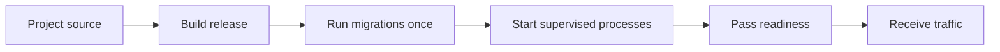

# Deploy an App

A GoForj release is a compiled App binary plus its production configuration. The same binary can run on a virtual machine, in a container, or under an orchestrator. GoForj does not require a particular hosting provider or process supervisor.

The normal release path is:



This page owns that path. The linked operations pages cover process topology, probes, metrics, backups, and security policy in more depth.

This page uses `forj` while preparing source and `./bin/<app>` after an artifact has been built. Production supervisors and release checks should execute the exact binary being deployed, not source-aware development commands.

## Before You Start

Decide which Apps belong in the release and where they will run. Provision the production database, queue, cache, storage, and other external services selected by those Apps. The deployment platform must also own DNS, TLS termination, network policy, process supervision, and secret delivery.

Choose a build environment compatible with the deployment target. If the Project uses native dependencies, prove the resulting binary on the same operating system and architecture used in production.

## Build the Release

For an App without frontend source:

```bash
forj build &&
  test -x ./bin/app
```

Expected result: `bin/app` exists and is executable. The build refreshes Framework-managed Project files, runs Wire, prepares the API index, and compiles the default App.

### Apps with Web UI

`forj dev` coordinates frontend and Go builds while you work. A standalone `forj build` does not currently rebuild React, Vue, or templ + htmx assets, so build them explicitly for a release:

```bash
npm --prefix cmd/app/frontend ci &&
  npm --prefix cmd/app/frontend run build &&
  forj build
```

Expected result: `cmd/app/frontend/dist` contains current frontend output and `bin/app` embeds that output. The deployed release does not need a separate frontend server unless the application was deliberately designed around one.

### Additional Apps

Build each independently deployable App. If it has frontend source, build that App's frontend first using its path under `cmd/<app>/frontend/`:

```bash
npm --prefix cmd/admin/frontend ci &&
  npm --prefix cmd/admin/frontend run build &&
  forj admin build &&
  test -x ./bin/admin
```

Expected result: `cmd/admin/frontend/dist` contains the current staff frontend and `bin/admin` contains the staff-facing App selected by the command prefix. Omit the npm steps when that App has no frontend source. Repeat the applicable frontend build, App build, and artifact check for every App included in the release.

Keep the artifact immutable after it has been tested. If a release is transferred to another host or registry, verify its checksum or image digest before activation.

### Hand Off the Artifact

The build system should hand the deployment system one identified, immutable release. Record at least:

- the binary or image digest;
- every App binary included in the release;
- the target operating system and architecture;
- the source revision and build time; and
- any non-secret defaults or overrides compiled with `forj build`.

Frontend output is already embedded in an App binary after the frontend build and `forj build`; do not deploy an unrelated `dist` directory beside it. Promote the same tested bytes between environments. If configuration or frontend assets require a rebuild, assign the result a new release identity and repeat artifact checks.

## Keep Configuration Outside the Artifact

Supply production configuration through the process environment or the secret and configuration mechanism provided by the deployment platform.

A small HTTP deployment might start with:

```text
APP_ENV=production
APP_DEBUG=false
APP_URL=https://api.example.com
API_HTTP_HOST=0.0.0.0
API_HTTP_PORT=3000
APP_SHUTDOWN_TIMEOUT=30s
QUEUE_SHUTDOWN_TIMEOUT=30s
APP_DIAG_TOKEN=<value-from-your-secret-store>
```

The rendered App determines the rest. Configure its selected database, queue, cache, storage, event, mail, and observability drivers with production values. Do not allow a missing production dependency to silently fall back to a process-local driver.

`forj build --env-defaults` and `--env-overrides` are explicit exceptions: they pin non-secret values into the binary. Defaults remain replaceable by deployment configuration; overrides do not. Use defaults only for artifact-level fallbacks and overrides only when every deployment of that artifact must use the same value. A rotated credential, environment endpoint, port, replica-specific identity, or retention setting belongs to the deployment system instead. See [Compiled Environment Values](/reference/configuration#compiled-environment-values) for exact precedence.

Bind to `127.0.0.1` when a reverse proxy on the same host owns public traffic. Bind to `0.0.0.0` only when a container network, firewall, or host network policy controls access.

If the App intentionally uses SQLite, local storage, uploads, or another writable filesystem path, place that data outside the versioned release directory and configure an absolute path. Replacing an immutable release must not replace or orphan durable application data.

See [Environment Reference](/reference/env-vars) for the complete generated configuration surface and [Production Hardening](/security/production-hardening) for security-sensitive settings.

## Choose the Processes to Run

Most initial deployments can supervise the combined runtime:

```bash
./bin/app
```

A runtime-capable binary selects `run` when launched without a command. It starts the enabled HTTP, worker, and scheduler runtimes together.

Split the runtimes only when they need different scaling, resource limits, restart behavior, or ownership:

| Process | Command |
| --- | --- |
| Combined runtime | `./bin/app` |
| HTTP | `./bin/app api` |
| Queue workers | `./bin/app worker` |
| Scheduler | `./bin/app scheduler` |

Changing the command does not change application behavior or make in-memory drivers shared between processes. Split processes that exchange work or state need cross-process queue, cache, event, storage, or database drivers.

Run one scheduler process unless the schedules use deliberate cross-process locking. See [Runtime Processes](/operations/runtime-processes) before introducing a split topology.

A concrete split deployment might use the same immutable artifact in these supervised process groups:

| Process group | Replicas | Traffic or work handoff | Scaling signal |
| --- | ---: | --- | --- |
| `./bin/app api` | Two or more | The platform sends HTTP traffic only to ready instances. | Request load, latency, and resource use. |
| `./bin/app worker --queue emails` | One or more | A shared queue backend hands jobs to workers. | Queue depth, job age, failures, and resource use. |
| `./bin/app scheduler` | One | The supervisor maintains singleton ownership unless schedules use a shared lock. | Availability and due-run outcomes, not HTTP load. |

This is a topology example, not a required replica count. Each group receives its own environment, resource limits, probe configuration, and restart policy. If an App has another binary such as `bin/admin`, model its HTTP, worker, and scheduler roles independently rather than assuming the default App process owns them.

## Give the Process to a Supervisor

The deployment platform should:

- run the binary as an unprivileged identity;
- provide its environment without placing secrets in the artifact;
- capture standard output and standard error;
- restart the process according to an explicit failure policy;
- deliver `SIGTERM` during shutdown;
- allow the App enough time to finish its graceful-stop path;
- keep liveness and readiness separate; and
- remove an instance from traffic before terminating it.

This contract applies equally to systemd, a container runtime, Kubernetes, Nomad, or another supervisor. The exact service unit or workload manifest belongs to that platform.

### Budget Timeouts as a System

Timeouts protect different boundaries and should be planned together:

| Boundary | Example control | What it bounds |
| --- | --- | --- |
| One unit of work | A job timeout or `SCHEDULER_COMMAND_TIMEOUT` | The handler or scheduled command execution. |
| Runtime cleanup | `QUEUE_SHUTDOWN_TIMEOUT` | Queue drain and backend cleanup inside App shutdown. |
| App shutdown | `APP_SHUTDOWN_TIMEOUT` | The HTTP or scheduler graceful-stop path and outer App lifecycle. |
| Readiness request | Probe or `health --timeout-ms` | One operator or platform request, including sequential resource checks. |
| Process supervision | Platform stop grace period | The complete interval before the platform may force termination. |

The App resolves this policy once at startup. A queue or scheduler subprocess value larger than `APP_SHUTDOWN_TIMEOUT` is capped to the App budget and emits one structured warning with the configured and effective values. Run `./bin/app about` to inspect the effective Runtime settings before changing supervisor limits.

Do not add every configured duration and assume that sum is the required supervisor value. Some shutdown work is concurrent, some limits are nested, and a handler that ignores cancellation can outlive its intended budget. Set the supervisor's stop grace period above the longest observed graceful-stop path with margin for traffic removal and supervisor overhead. In combined mode, runtime shutdown happens concurrently before the outer App lifecycle finishes. Test `SIGTERM` with real in-flight requests, jobs, and scheduled commands; make interrupted work safe to retry.

The long-running command must be the deployed binary:

```text
/srv/example/releases/2026-07-28/bin/app
```

Do not use `forj dev`, `go run`, or a source checkout as the production process.

## Prepare Data Before Traffic Moves

Database migrations are explicit. An App with database support does not migrate automatically when its runtime starts.

Create and verify a recovery point, then run migrations from the staged release:

```bash
/srv/example/releases/2026-07-28/bin/app migrate
```

Expected result: the migration command exits successfully before processes from that release receive traffic.

Run the command once per migration-owning App, not once per HTTP replica. During a rolling deployment, prefer additive schema changes that work with both the old and new binaries.

For an additional migration-owning App, run that App's staged binary independently:

```bash
/srv/example/releases/2026-07-28/bin/admin migrate
```

Expected result: only the `admin` App's migration streams run. Repeat this once for each migration-owning App in the release; do not infer that the default App command migrated additional Apps.

Use stable paths for backup output rather than writing backup sets inside a versioned release directory. [Backup and Restore](/operations/backups) covers discovery, verification, retention, and restore safeguards.

## Hand Off Observability and Retention

The App emits signals; the deployment platform and operators own their transport, access, and retention. Before activation, assign each signal to an operational destination:

| Signal or data | App/process responsibility | Deployment responsibility |
| --- | --- | --- |
| Logs | Write structured runtime output to standard output and standard error. | Collect, index, redact, retain, and alert on it. |
| Metrics | Expose the endpoint appropriate to combined or split topology. | Scrape it with bounded labels, retain time series, and define alerts. |
| Health and readiness | Report process liveness and required dependency state. | Route probes correctly and remove unready HTTP instances from traffic. |
| Inspects and Lighthouse | Capture and present bounded recent execution detail when enabled. | Restrict operator access and choose capture, sampling, and recent-window limits. |
| Backups and durable data | Use the configured stable paths and backends. | Schedule backups, apply retention, verify restore, and keep data outside release directories. |

Preserve the app name, runtime role, release identity, and instance identity in the surrounding platform metadata so an alert can be traced to the exact process and artifact. Set `APP_VERSION` and `APP_REVISION` while building framework-managed metrics discovery, and apply equivalent bounded labels in an external production scraper. Lighthouse's recent Inspect window is not a substitute for retained logs, metrics, or backups.

## Activate the Release

A useful filesystem layout separates immutable releases from mutable state:

```text
/srv/example/releases/2026-07-28/   immutable release
/srv/example/current                active release reference
/etc/example/app.env                configuration and secrets
/var/lib/example/                   intentionally local durable data
/var/backups/example/               backup sets
```

Activation should be one platform-level operation: update the active release reference or deploy the new image, then ask the supervisor to replace the old process.

For more than one HTTP replica:

1. Remove one instance from traffic.
2. Install and start the new release.
3. Wait for readiness and run a smoke request.
4. Return the instance to traffic.
5. Continue with the next instance.

Workers may need to drain when a release changes an enqueued payload or handler contract. Keep scheduler ownership singular throughout the rollout.

## Verify Before Sending Traffic

First verify the artifact's command surface without starting a listener:

```bash
./bin/app route:list
```

Expected result: the release prints the routes expected for this App.

Then check the running process:

```bash
curl --fail http://127.0.0.1:3000/-/health &&
  curl --fail http://127.0.0.1:3000/-/ready &&
  ./bin/app health http://127.0.0.1:3000 \
    --probe ready \
    --timeout-ms 10000 \
    --fail
```

Expected result:

- health returns HTTP 200 because the HTTP process is alive;
- public readiness returns HTTP 200 only after required dependencies pass; and
- the `health` command exits zero and includes authorized diagnostic detail when `APP_DIAG_TOKEN` is configured in the operator environment.

Readiness checks have per-resource timeouts. Give the operator command and deployment probe enough total time for the number of configured resources, while keeping the load balancer's failure threshold bounded.

If metrics are enabled on a combined App with HTTP, verify the route on the HTTP listener:

```bash
curl --fail http://127.0.0.1:3000/metrics
```

Expected result: the response uses Prometheus text format. Split runtimes may expose dedicated metrics listeners; use [Metrics](/operations/metrics) to select the endpoint that matches the process topology.

Finally, request one application route that proves the release can perform its intended work. Framework probes do not prove that authentication, routing, and application behavior are correct together.

## Roll Back Safely

Keep the previous artifact until the new release has passed readiness and application smoke checks.

If verification fails:

1. Remove the failed release from traffic.
2. Reactivate the previous artifact or image.
3. Restart the affected processes.
4. Repeat health, readiness, metrics, and application checks.
5. Preserve the failed release's logs and diagnostics for investigation.

A binary rollback does not reverse a database migration. Plan schema rollback separately, and avoid destructive or incompatible migrations while old binaries may still run.

Queue payloads are another compatibility boundary. A previous worker binary must still understand queued work if it may be restored during rollback.

## Failure Modes

| Symptom | Likely cause | What to check |
| --- | --- | --- |
| The new binary serves an older frontend | `frontend/dist` was not rebuilt before `forj build` | Rebuild the owning App's frontend and compile a new artifact. |
| Health passes but readiness fails | The process is alive, but a required dependency is unavailable | Run the authorized `health` command and inspect the failed check without exposing its detail publicly. |
| A migration is missing | The old or active release ran `migrate` instead of the staged release | Run the staged binary explicitly and confirm the migration-owning App. |
| Local data disappears after activation | A relative SQLite or storage path resolved inside the replaced release | Move durable data to a stable directory and configure an absolute path. |
| The supervisor kills the App during shutdown | Its stop grace period is shorter than the real graceful-stop path | Measure shutdown with in-flight work and increase the supervisor margin or make work resumable. |
| Metrics return connection refused | The scrape target does not match combined or split topology | Use the HTTP `/metrics` route for a combined HTTP App and the configured runtime port for split processes. |

## Production Checklist

- Build every App for the deployment target.
- Build frontend assets before `forj build` when the App has Web UI.
- Store production configuration and secrets outside the artifact.
- Record any non-secret defaults or overrides intentionally compiled into it.
- Use production drivers for state shared across processes or hosts.
- Keep writable data and backup sets outside immutable release directories.
- Run the staged release's migrations once before it receives traffic.
- Supervise each required process with the deployed binary.
- Keep the scheduler singleton unless locking makes overlap safe.
- Set and test graceful shutdown budgets.
- Assign logs, metrics, Inspects, and backups explicit access and retention owners.
- Verify liveness, readiness, metrics, and one application workflow.
- Keep the previous artifact available for binary rollback.
- Treat database migrations and queued payloads as separate rollback contracts.

## Next Steps

- [Runtime Processes](/operations/runtime-processes) covers combined and split process ownership.
- [Health and Readiness](/operations/health-readiness) explains public and authorized probes.
- [Metrics](/operations/metrics) maps scrape endpoints to runtime topology.
- [Queue Workers](/operations/queue-workers) covers draining and worker shutdown.
- [Scheduler Processes](/operations/scheduler-processes) covers singleton ownership and locks.
- [Backup and Restore](/operations/backups) covers recovery workflows.
- [Production Hardening](/security/production-hardening) covers runtime security settings.
