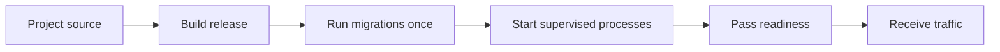

# Deploy an App

A GoForj release is a compiled App binary plus its production configuration. The same binary can run on a virtual machine, in a container, or under an orchestrator. GoForj does not require a particular hosting provider or process supervisor.

The normal release path is:



This page owns that path. The linked operations pages cover process topology, probes, metrics, backups, and security policy in more depth.

## Before You Start

Decide which Apps belong in the release and where they will run. Provision the production database, queue, cache, storage, and other external services selected by those Apps. The deployment platform must also own DNS, TLS termination, network policy, process supervision, and secret delivery.

Choose a build environment compatible with the deployment target. If the Project uses native dependencies, prove the resulting binary on the same operating system and architecture used in production.

## Build the Release

Build the default App:

```bash
forj build &&
  test -x ./bin/app
```

Expected result: `bin/app` exists and is executable. The build refreshes generated Project files, ensures configured SPA assets are current, runs Wire, prepares the API index, and compiles the default App.

### Apps with Web UI

Use the same release command for an App with frontend source:

```bash
forj build
```

GoForj checks all SPAs configured under `dev.apps` and runs only stale SPA builds before compiling Go. It also installs dependencies for npm-based builds. A successful `forj dev` frontend build is reused by this check. Expected result: every configured `dist` directory contains current frontend output and `bin/app` embeds the default App's output. The deployed release does not need a separate frontend server unless the application was deliberately designed around one.

### Additional Apps

Build each independently deployable App:

```bash
forj admin build &&
  test -x ./bin/admin
```

Expected result: `bin/admin` contains the staff-facing App selected by the command prefix. Repeat the build for every App included in the release.

Keep the artifact immutable after it has been tested. If a release is transferred to another host or registry, verify its checksum or image digest before activation.

## Keep Configuration Outside the Artifact

Supply production configuration through the process environment or the secret and configuration mechanism provided by the deployment platform.

A small HTTP deployment might start with:

```text
APP_ENV=production
APP_DEBUG=false
APP_URL=https://api.example.com
API_HTTP_HOST=0.0.0.0
API_HTTP_PORT=3000
APP_SHUTDOWN_TIMEOUT=30s
QUEUE_SHUTDOWN_TIMEOUT=30s
APP_DIAG_TOKEN=<value-from-your-secret-store>
```

The rendered App determines the rest. Configure its selected database, queue, cache, storage, event, mail, and observability drivers with production values. Do not allow a missing production dependency to silently fall back to a process-local driver.

Bind to `127.0.0.1` when a reverse proxy on the same host owns public traffic. Bind to `0.0.0.0` only when a container network, firewall, or host network policy controls access.

If the App intentionally uses SQLite, local storage, uploads, or another writable filesystem path, place that data outside the versioned release directory and configure an absolute path. Replacing an immutable release must not replace or orphan durable application data.

See [Environment Reference](/reference/env-vars) for the complete generated configuration surface and [Production Hardening](/security/production-hardening) for security-sensitive settings.

## Use Maintenance Mode

Set maintenance mode through deployment configuration when application traffic must pause during planned work:

```text
APP_MAINTENANCE_ENABLED=true
```

Restart the App after changing the value. Application routes then return HTTP 503 without rebuilding the binary or any frontend. Browser navigation receives a self-contained maintenance page shared by every official starter kit; `/api` routes and clients that explicitly request JSON receive a stable JSON error response. `forj about` reports whether maintenance mode was enabled when the process started.

Health, readiness, metrics, and Lighthouse routes stay available during maintenance. This keeps the process observable and prevents planned application downtime from looking like a crashed instance:

```bash
curl --fail http://127.0.0.1:3000/-/health
curl --fail http://127.0.0.1:3000/-/ready
curl --fail http://127.0.0.1:3000/metrics
curl --fail-with-body http://127.0.0.1:3000/
```

Expected result: the operational routes remain available and the application request returns HTTP 503. Disable the setting and restart the App when the work is complete. For an additional App, use its normal environment overlay, such as `ADMIN_APP_MAINTENANCE_ENABLED=true`.

## Choose the Processes to Run

Most initial deployments can supervise the combined runtime:

```bash
./bin/app
```

A runtime-capable binary selects `run` when launched without a command. It starts the enabled HTTP, worker, and scheduler runtimes together.

Split the runtimes only when they need different scaling, resource limits, restart behavior, or ownership:

| Process | Command |
| --- | --- |
| Combined runtime | `./bin/app` |
| HTTP | `./bin/app api` |
| Queue workers | `./bin/app worker` |
| Scheduler | `./bin/app scheduler` |

Changing the command does not change application behavior or make in-memory drivers shared between processes. Split processes that exchange work or state need cross-process queue, cache, event, storage, or database drivers.

Run one scheduler process unless the schedules use deliberate cross-process locking. See [Runtime Processes](/operations/runtime-processes) before introducing a split topology.

## Give the Process to a Supervisor

The deployment platform should:

- run the binary as an unprivileged identity;
- provide its environment without placing secrets in the artifact;
- capture standard output and standard error;
- restart the process according to an explicit failure policy;
- deliver `SIGTERM` during shutdown;
- allow the App enough time to finish its graceful-stop path;
- keep liveness and readiness separate; and
- remove an instance from traffic before terminating it.

This contract applies equally to systemd, a container runtime, Kubernetes, Nomad, or another supervisor. The exact service unit or workload manifest belongs to that platform.

Set the supervisor's stop grace period above the longest effective App shutdown path, with additional margin for the supervisor itself. In combined mode, runtime shutdown happens concurrently before the outer App lifecycle finishes. Test shutdown with real in-flight jobs instead of relying only on arithmetic.

The long-running command must be the deployed binary:

```text
/srv/example/releases/2026-07-28/bin/app
```

Do not use `forj dev`, `go run`, or a source checkout as the production process.

## Prepare Data Before Traffic Moves

Database migrations are explicit. An App with database support does not migrate automatically when its runtime starts.

Create and verify a recovery point, then run migrations from the staged release:

```bash
/srv/example/releases/2026-07-28/bin/app migrate
```

Expected result: the migration command exits successfully before processes from that release receive traffic.

Run the command once per migration-owning App, not once per HTTP replica. During a rolling deployment, prefer additive schema changes that work with both the old and new binaries.

Use stable paths for backup output rather than writing backup sets inside a versioned release directory. [Backup and Restore](/operations/backups) covers discovery, verification, retention, and restore safeguards.

## Activate the Release

A useful filesystem layout separates immutable releases from mutable state:

```text
/srv/example/releases/2026-07-28/   immutable release
/srv/example/current                active release reference
/etc/example/app.env                configuration and secrets
/var/lib/example/                   intentionally local durable data
/var/backups/example/               backup sets
```

Activation should be one platform-level operation: update the active release reference or deploy the new image, then ask the supervisor to replace the old process.

For more than one HTTP replica:

1. Remove one instance from traffic.
2. Install and start the new release.
3. Wait for readiness and run a smoke request.
4. Return the instance to traffic.
5. Continue with the next instance.

Workers may need to drain when a release changes an enqueued payload or handler contract. Keep scheduler ownership singular throughout the rollout.

## Verify Before Sending Traffic

First verify the artifact's command surface without starting a listener:

```bash
./bin/app route:list
```

Expected result: the release prints the routes expected for this App.

Then check the running process:

```bash
curl --fail http://127.0.0.1:3000/-/health &&
  curl --fail http://127.0.0.1:3000/-/ready &&
  ./bin/app health http://127.0.0.1:3000 \
    --probe ready \
    --timeout-ms 10000 \
    --fail
```

Expected result:

- health returns HTTP 200 because the HTTP process is alive;
- public readiness returns HTTP 200 only after required dependencies pass; and
- the `health` command exits zero and includes authorized diagnostic detail when `APP_DIAG_TOKEN` is configured in the operator environment.

Readiness checks have per-resource timeouts. Give the operator command and deployment probe enough total time for the number of configured resources, while keeping the load balancer's failure threshold bounded.

If metrics are enabled on a combined App with HTTP, verify the route on the HTTP listener:

```bash
curl --fail http://127.0.0.1:3000/metrics
```

Expected result: the response uses Prometheus text format. Split runtimes may expose dedicated metrics listeners; use [Metrics](/operations/metrics) to select the endpoint that matches the process topology.

Finally, request one application route that proves the release can perform its intended work. Framework probes do not prove that authentication, routing, and application behavior are correct together.

## Roll Back Safely

Keep the previous artifact until the new release has passed readiness and application smoke checks.

If verification fails:

1. Remove the failed release from traffic.
2. Reactivate the previous artifact or image.
3. Restart the affected processes.
4. Repeat health, readiness, metrics, and application checks.
5. Preserve the failed release's logs and diagnostics for investigation.

A binary rollback does not reverse a database migration. Plan schema rollback separately, and avoid destructive or incompatible migrations while old binaries may still run.

Queue payloads are another compatibility boundary. A previous worker binary must still understand queued work if it may be restored during rollback.

## Failure Modes

| Symptom | Likely cause | What to check |
| --- | --- | --- |
| The new binary serves an older frontend | The SPA is not listed under `dev.apps`, or external tooling preserved both file size and modification time while replacing source contents | Add the SPA lifecycle configuration, or update the source modification time and rerun `forj build`. |
| Health passes but readiness fails | The process is alive, but a required dependency is unavailable | Run the authorized `health` command and inspect the failed check without exposing its detail publicly. |
| A migration is missing | The old or active release ran `migrate` instead of the staged release | Run the staged binary explicitly and confirm the migration-owning App. |
| Local data disappears after activation | A relative SQLite or storage path resolved inside the replaced release | Move durable data to a stable directory and configure an absolute path. |
| The supervisor kills the App during shutdown | Its stop grace period is shorter than the real graceful-stop path | Measure shutdown with in-flight work and increase the supervisor margin or make work resumable. |
| Metrics return connection refused | The scrape target does not match combined or split topology | Use the HTTP `/metrics` route for a combined HTTP App and the configured runtime port for split processes. |

## Production Checklist

- Build every App for the deployment target.
- Confirm every deployable SPA is configured under `dev.apps`; `forj build` then keeps its assets current.
- Store production configuration and secrets outside the artifact.
- Use production drivers for state shared across processes or hosts.
- Keep writable data and backup sets outside immutable release directories.
- Run the staged release's migrations once before it receives traffic.
- Supervise each required process with the deployed binary.
- Keep the scheduler singleton unless locking makes overlap safe.
- Set and test graceful shutdown budgets.
- Verify liveness, readiness, metrics, and one application workflow.
- Use maintenance mode when planned work requires application traffic to return HTTP 503 while operational routes remain available.
- Keep the previous artifact available for binary rollback.
- Treat database migrations and queued payloads as separate rollback contracts.

## Next Steps

- [Runtime Processes](/operations/runtime-processes) covers combined and split process ownership.
- [Health and Readiness](/operations/health-readiness) explains public and authorized probes.
- [Metrics](/operations/metrics) maps scrape endpoints to runtime topology.
- [Queue Workers](/operations/queue-workers) covers draining and worker shutdown.
- [Scheduler Processes](/operations/scheduler-processes) covers singleton ownership and locks.
- [Backup and Restore](/operations/backups) covers recovery workflows.
- [Production Hardening](/security/production-hardening) covers runtime security settings.
