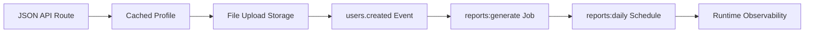

# Runnable Scenarios

Runnable scenarios show complete framework workflows inside a generated GoForj App.

Use these after the Quickstart when you want to build real application behavior instead of only reading individual feature pages.

If you are learning GoForj for the first time, treat this section as the main guided tutorial after Getting Started. Feature pages explain one surface at a time; scenarios show how those surfaces compose inside a generated App.

## The Path

Seven scenarios, in order, each adding one boundary to the same App. Plan on a bit over two hours end to end, or one scenario per sitting. By the end you have a fully observable system: a tested API with caching, file storage, events, queue-backed jobs, a schedule, and operator visibility over all of it.

1. [JSON API Route](/scenarios/json-api-route) · about 15 minutes. A route, controller, service, Wire provider, and service test.
2. [Cached User Profile](/scenarios/cached-user-profile) · about 15 minutes. A repository boundary and a named cache resource.
3. [File Upload to Storage](/scenarios/file-upload-storage) · about 20 minutes. Uploads written to a named storage disk.
4. [Users Created Event](/scenarios/users-created-event) · about 25 minutes. A typed event published and handled by a subscriber.
5. [Reports Generate Job](/scenarios/reports-generate-job) · about 25 minutes. Queue-backed work dispatched from the subscriber and processed by a worker; the selected driver determines durability and process reach.
6. [Reports Daily Schedule](/scenarios/reports-daily-schedule) · about 15 minutes. The same job dispatched on a recurring cadence.
7. [Runtime Observability](/scenarios/runtime-observability) · about 15 minutes. The whole workflow followed through routes, metrics, inspects, Lighthouse, and logs.

## Golden Path State

| Step | App State Before | App State After |
| --- | --- | --- |
| JSON API Route | Generated App with HTTP enabled | One tested user lookup route is registered and visible in `route:list`. |
| Cached User Profile | User route exists | User lookup has a repository boundary and named `profiles` cache. |
| File Upload to Storage | App has HTTP and generated storage support | Uploads write to a named `uploads` storage disk. |
| Users Created Event | User service owns read/write behavior | Creating a user publishes a typed `users.created` event and a subscriber reacts to it. |
| Reports Generate Job | Event subscriber exists | Subscriber dispatches queue-backed `reports:generate` work; the selected driver determines durability and process reach. |
| Reports Daily Schedule | Report job exists | `reports:daily` schedule dispatches the same report job on a recurring cadence. |
| Runtime Observability | API, cache, storage, event, job, and schedule paths exist | The whole workflow can be followed through routes, logs, metrics, inspects, and Lighthouse. |

## How to Read These

Each scenario uses the same small internal reporting app shape.

The examples are intentionally local-first. Production drivers, distributed backends, and operational deployment notes appear only after the local path works.

## After the Path

Finishing all seven leaves you with the App this whole documentation set describes. From there:

- [Production Checklist](/operations/production-checklist) when you want to ship it.
- [Cookbook](/cookbook) when you come back with a specific task.
- [Apps](/core/apps) when the Project outgrows a single app.

## Related Pages

- [Quickstart](/getting-started/quickstart)
- [Project Structure](/getting-started/project-structure)
- [Dependency Injection](/core/dependency-injection)
- [Applications](/applications/)
