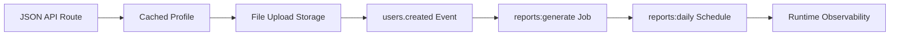

# Runnable Scenarios

Runnable scenarios show complete framework workflows inside a generated GoForj App.

Use these after the Quickstart when you want to build real application behavior instead of only reading individual feature pages.

If you are learning GoForj for the first time, treat this section as the main guided tutorial after Getting Started. Feature pages explain one surface at a time; scenarios show how those surfaces compose inside a generated App.

## Scenarios

- [JSON API Route](/scenarios/json-api-route) builds a route, controller, service, Wire provider, route registration, and service test.
- [Cached User Profile](/scenarios/cached-user-profile) adds a repository and named cache resource.
- [File Upload To Storage](/scenarios/file-upload-storage) writes uploads to a named storage disk.
- [Users Created Event](/scenarios/users-created-event) publishes a typed event and handles it with a lifecycle-registered subscriber.
- [Reports Generate Job](/scenarios/reports-generate-job) dispatches durable work from an event subscriber and processes it with a worker.
- [Reports Daily Schedule](/scenarios/reports-daily-schedule) schedules recurring report dispatch without duplicating job logic.
- [Runtime Observability](/scenarios/runtime-observability) follows the workflow through routes, metrics, inspects, Lighthouse, and logs.

Read them in order if you are learning the framework model. Each scenario builds on the same App shape and adds one new boundary.

## Golden Path State

| Step | App State Before | App State After |
| --- | --- | --- |
| JSON API Route | Generated App with HTTP enabled | One tested user lookup route is registered and visible in `route:list`. |
| Cached User Profile | User route exists | User lookup has a repository boundary and named `profiles` cache. |
| File Upload To Storage | App has HTTP and generated storage support | Uploads write to a named `uploads` storage disk. |
| Users Created Event | User service owns read/write behavior | Creating a user publishes a typed `users.created` event and a subscriber reacts to it. |
| Reports Generate Job | Event subscriber exists | Subscriber dispatches durable `reports:generate` work and workers write report artifacts. |
| Reports Daily Schedule | Report job exists | `reports:daily` schedule dispatches the same report job on a recurring cadence. |
| Runtime Observability | API, cache, storage, event, job, and schedule paths exist | The whole workflow can be followed through routes, logs, metrics, inspects, and Lighthouse. |

## How To Read These

Each scenario uses the same small internal reporting app shape.

The examples are intentionally local-first. Production drivers, distributed backends, and operational deployment notes appear only after the local path works.

## Related Pages

- [Quickstart](/getting-started/quickstart)
- [Project Structure](/getting-started/project-structure)
- [Dependency Injection](/core/dependency-injection)
- [Applications](/applications/)
