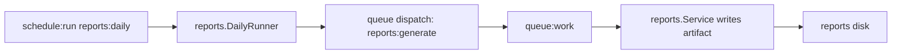

# Reports Daily Schedule

This scenario adds a `reports:daily` schedule that dispatches the existing `reports:generate` job.

The schedule decides when daily report work should begin. The queue still owns durable execution, retries, worker lifecycle, and failure visibility.

## What You Will Build

- `internal/reports/daily.go` selects users that need daily reports.
- `internal/scheduler/scheduler_registry.go` registers a named `reports:daily` schedule.
- The schedule calls a domain-owned method instead of putting report logic in scheduler bootstrap.
- The method dispatches `reports:generate` jobs, so workers continue to process report generation.



## Prerequisites

Complete [Reports Generate Job](/scenarios/reports-generate-job) first.

The generated App should have scheduler and jobs enabled. Verify these generated packages exist:

```text
internal/scheduler
internal/jobs
internal/queues
```

## Golden Path State

Before this scenario, reports are generated when the `users.created` subscriber dispatches `reports:generate`.

After this scenario, `reports:daily` can start the same report workflow on a recurring schedule. The schedule decides when work begins; the queue and workers still own durable execution.

## Files

This scenario edits or creates:

```text
internal/reports/daily.go
internal/reports/daily_test.go
internal/scheduler/scheduler_registry.go
wire/inject_app_services.go
```

## Step 1: Add A Daily Runner

Create `internal/reports/daily.go`:

```go
package reports

import (
	"context"
	"fmt"
)

type DailyTarget struct {
	UserID string
	Email  string
}

type DailyTargetRepository interface {
	DueForDailyReport(ctx context.Context) ([]DailyTarget, error)
}

type ReportQueue interface {
	Queue(ctx context.Context, userID string, email string) error
}

type DailyRunner struct {
	targets DailyTargetRepository
	reports ReportQueue
}

func NewDailyRunner(targets DailyTargetRepository, reports ReportQueue) *DailyRunner {
	return &DailyRunner{
		targets: targets,
		reports: reports,
	}
}

func (r *DailyRunner) Run(ctx context.Context) error {
	targets, err := r.targets.DueForDailyReport(ctx)
	if err != nil {
		return fmt.Errorf("load daily report targets: %w", err)
	}

	for _, target := range targets {
		if err := r.reports.Queue(ctx, target.UserID, target.Email); err != nil {
			return fmt.Errorf("queue daily report for %s: %w", target.UserID, err)
		}
	}

	return nil
}
```

The runner does not generate reports itself. It turns a recurring schedule into durable queued work.

## Step 2: Register The Schedule

Open `internal/scheduler/scheduler_registry.go`.

Inject the daily runner into the scheduler type, then register the schedule:

```go
func (s *Scheduler) Register() error {
	s.DailyAt("04:00").
		Name("reports:daily").
		Do(s.inspectTask("reports:daily", s.dailyReports.Run))

	return nil
}
```

Keep the registry declarative. The registry names the schedule and points to the domain-owned method.

## Step 3: Wire The Runner

Open `wire/inject_app_services.go`.

Bind the existing `GenerateReportJob` to the small queueing interface:

```go
var appSet = wire.NewSet(
	reports.NewDailyRunner,
	wire.Bind(new(reports.ReportQueue), new(*jobs.GenerateReportJob)),
	// existing providers...
)
```

Provide a `DailyTargetRepository` from your user repository or reporting repository. The important boundary is the interface: the schedule asks for report targets, then dispatches jobs.

## Step 4: Build

Run:

```bash
forj build
```

This regenerates Wire and builds the App binary.

## Verify

Start a worker in one terminal:

```bash
forj run worker
```

Start the scheduler in another terminal:

```bash
forj run scheduler
```

For a fast local check, temporarily use a short interval while developing:

```go
s.Every(30).Seconds().
	Name("reports:daily").
	Do(s.inspectTask("reports:daily", s.dailyReports.Run))
```

When the schedule runs, the worker should process `reports:generate` jobs and write report artifacts under:

```text
storage/app/reports/users/{userID}/profile.json
```

Return to `DailyAt("04:00")` before treating the schedule as production-shaped.

## Test The Runner

Create `internal/reports/daily_test.go`:

```go
package reports

import (
	"context"
	"testing"
)

type fakeDailyTargets struct {
	targets []DailyTarget
}

func (f fakeDailyTargets) DueForDailyReport(context.Context) ([]DailyTarget, error) {
	return f.targets, nil
}

type fakeReportQueue struct {
	queued []DailyTarget
}

func (f *fakeReportQueue) Queue(_ context.Context, userID string, email string) error {
	f.queued = append(f.queued, DailyTarget{UserID: userID, Email: email})
	return nil
}

func TestDailyRunnerQueuesReports(t *testing.T) {
	queue := &fakeReportQueue{}
	runner := NewDailyRunner(
		fakeDailyTargets{targets: []DailyTarget{{UserID: "42", Email: "ada@example.test"}}},
		queue,
	)

	if err := runner.Run(context.Background()); err != nil {
		t.Fatalf("run daily reports: %v", err)
	}
	if len(queue.queued) != 1 {
		t.Fatalf("queued reports = %d", len(queue.queued))
	}
}
```

Run:

```bash
go test ./...
```

The unit test proves schedule target behavior without waiting for the scheduler runtime.

## Production

Run scheduler processes explicitly:

```bash
./bin/app scheduler
```

Keep the scheduler singleton unless your locking strategy supports more than one scheduler process. Scale workers separately:

```bash
./bin/app worker
```

## Common Mistakes

::: warning Common mistakes
- Do not duplicate report generation logic in the scheduler registry.
- Do not use an anonymous callback for `reports:daily`.
- Do not treat a schedule as a durable queue.
- Do not run multiple scheduler processes unless overlap and locking behavior are intentional.
- Do not skip the worker process; the schedule dispatches jobs, and workers perform the work.
:::

## Next Step

Next, follow the full API, event, job, schedule, metrics, inspects, Lighthouse, and log path in [Runtime Observability](/scenarios/runtime-observability).
