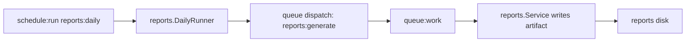

# Reports Daily Schedule

::: info Verified Scenario
This page is generated from an executable spec. An automated suite renders a fresh App from the current GoForj templates, applies every step below in order, and runs every verification command. If any step fails, the page does not ship.
:::

Scenario 6 of 7 in the [verified path](/scenarios/). Plan on about 15 minutes.

This scenario adds a `reports:daily` schedule that dispatches the existing `reports:generate` job.

The schedule decides when daily report work should begin. The queue still owns execution, retries, worker lifecycle, and failure visibility.

## What You Will Build

- `internal/reports/daily.go` selects users that need daily reports.
- `app/schedules.go` registers a named `reports:daily` schedule.
- The schedule calls a domain-owned method instead of putting report logic in scheduler bootstrap.
- The method dispatches `reports:generate` jobs, so workers continue to process report generation.



## Prerequisites

Complete [Reports Generate Job](/scenarios/reports-generate-job) first.

The generated App should have scheduler and jobs enabled. Verify these generated packages exist:

```text
internal/schedules
internal/jobs
internal/queues
```

## Golden Path State

Before this scenario, reports are generated when the `users.created` subscriber dispatches `reports:generate`.

After this scenario, `reports:daily` can start the same report workflow on a recurring schedule. The schedule decides when work begins; the queue and workers still own execution.

## Files

This scenario edits or creates:

**Reports feature**

```text
internal/reports/daily.go
internal/reports/daily_test.go
```

**Users repository**

```text
internal/users/repository.go
```

**Scheduler**

```text
app/schedules.go
```

**App wiring**

```text
app/wire/inject_services_app.go
```

## Step 1: Add a Daily Runner

Create `internal/reports/daily.go`.

The runner does not generate reports itself. It turns a recurring schedule into queued work.

Create or replace `internal/reports/daily.go`:

```go
// Package reports keeps scheduled dispatch beside the report workflow it triggers.
package reports

import (
	"context"
	"fmt"
)

// DailyTarget carries the stable identity required to queue a report without loading the full user model.
type DailyTarget struct {
	UserID string
	Email  string
}

// DailyTargetRepository keeps schedule eligibility rules behind the application's persistence boundary.
type DailyTargetRepository interface {
	// ListDailyReportTargets returns only the stable fields needed to enqueue daily work.
	ListDailyReportTargets(ctx context.Context) ([]DailyTarget, error)
}

// DailyRunner turns one scheduler invocation into queue-backed report jobs without generating reports inline.
type DailyRunner struct {
	targets DailyTargetRepository
	queue   ReportQueue
}

// NewDailyRunner requires both collaborators so a registered schedule cannot silently skip report work.
func NewDailyRunner(targets DailyTargetRepository, queue ReportQueue) *DailyRunner {
	return &DailyRunner{
		targets: targets,
		queue:   queue,
	}
}

// Run loads eligible targets at execution time so registration stays declarative and work leaves the scheduler boundary.
func (r *DailyRunner) Run(ctx context.Context) error {
	targets, err := r.targets.ListDailyReportTargets(ctx)
	if err != nil {
		return fmt.Errorf("load daily report targets: %w", err)
	}

	for _, target := range targets {
		if err := r.queue.Queue(ctx, target.UserID, target.Email); err != nil {
			return fmt.Errorf("queue daily report for %s: %w", target.UserID, err)
		}
	}

	return nil
}
```

## Step 2: Add Daily Targets to the Repository

Extend `MemoryUserRepository` so the schedule can ask the repository for due report targets.

Update `internal/users/repository.go` so it includes:

```go
"github.com/goforj/cache"

"your/module/internal/reports"
```

## Step 3: Implement Daily Target Lookup

Keep target selection behind the repository boundary.

Update `internal/users/repository.go` so it includes:

```go
// Save serializes ID assignment with persistence so concurrent requests cannot claim the same ID.
func (r *MemoryUserRepository) Save(_ context.Context, user User) (User, error) {
	r.mu.Lock()
	defer r.mu.Unlock()

	if user.ID == "" {
		user.ID = strconv.Itoa(r.nextID)
		r.nextID++
	}
	r.users[user.ID] = user
	return user, nil
}

// ListDailyReportTargets keeps selection behind the repository; this in-memory example treats every user as due.
func (r *MemoryUserRepository) ListDailyReportTargets(_ context.Context) ([]reports.DailyTarget, error) {
        r.mu.RLock()
        defer r.mu.RUnlock()

	targets := make([]reports.DailyTarget, 0, len(r.users))
	for _, user := range r.users {
		targets = append(targets, reports.DailyTarget{
			UserID: user.ID,
			Email:  user.Email,
		})
	}
	return targets, nil
}
```

## Step 4: Import Reports into the Schedule Registry

Add the daily runner package to the app-owned schedule registry.

Update `app/schedules.go` so it includes:

```go
"your/module/internal/reports"
"your/module/internal/schedules"
```

## Step 5: Add Schedule Registry Field

Store the injected runner on the app schedule registry.

Update `app/schedules.go` so it includes:

```go
type ScheduleRegistry struct {
        dailyReports *reports.DailyRunner
```

## Step 6: Add Schedule Registry Constructor Parameter

Wire can now provide the runner to the app schedule registry.

Update `app/schedules.go` so it includes:

```go
func NewScheduleRegistry(
        dailyReports *reports.DailyRunner,
```

## Step 7: Assign Schedule Registry Runner

Preserve generated schedule wiring and add the new field assignment.

Update `app/schedules.go` so it includes:

```go
return &ScheduleRegistry{
        dailyReports: dailyReports,
```

## Step 8: Register the Schedule

Keep the registry declarative. The registry names the schedule and points to the domain-owned method.

Update `app/schedules.go` so it includes:

```go
func (r *ScheduleRegistry) Register(s *schedules.Scheduler) error {
        s.DailyAt("04:00").
                Name("reports:daily").
                Do(s.InspectTask("reports:daily", r.dailyReports.Run))
```

## Step 9: Wire the Runner

The previous scenario already binds the report job to `ReportQueue`. Add the daily runner and bind the user repository to daily target lookup.

Update `app/wire/inject_services_app.go` so it includes:

```go
provideReportService,
reports.NewDailyRunner,
wire.Bind(new(reports.DailyTargetRepository), new(*users.MemoryUserRepository)),
```

## Step 10: Test the Runner

Create `internal/reports/daily_test.go`.

The unit test proves schedule target behavior without waiting for the scheduler runtime.

Create or replace `internal/reports/daily_test.go`:

```go
// Package reports verifies schedule dispatch without starting scheduler or worker runtimes.
package reports

import (
	"context"
	"slices"
	"testing"
)

// fakeDailyTargetRepository gives the runner a fixed eligibility result without persistence setup.
type fakeDailyTargetRepository struct {
	targets []DailyTarget
}

// ListDailyReportTargets returns the fixture's declared targets so the test controls schedule input.
func (repo fakeDailyTargetRepository) ListDailyReportTargets(context.Context) ([]DailyTarget, error) {
	return repo.targets, nil
}

// recordingReportQueue exposes queued targets without starting a worker runtime.
type recordingReportQueue struct {
	queued []DailyTarget
}

// Queue records the job-dispatch boundary while satisfying the same interface as the generated report job.
func (queue *recordingReportQueue) Queue(_ context.Context, userID string, email string) error {
	queue.queued = append(queue.queued, DailyTarget{UserID: userID, Email: email})
	return nil
}

// TestDailyRunnerQueuesReports proves one schedule invocation dispatches every eligible target exactly once.
func TestDailyRunnerQueuesReports(t *testing.T) {
	targets := []DailyTarget{
		{UserID: "42", Email: "ada@example.test"},
		{UserID: "43", Email: "grace@example.test"},
	}
	queue := &recordingReportQueue{}
	runner := NewDailyRunner(
		fakeDailyTargetRepository{targets: targets},
		queue,
	)

	if err := runner.Run(context.Background()); err != nil {
		t.Fatalf("run daily reports: %v", err)
	}
	if !slices.Equal(queue.queued, targets) {
		t.Fatalf("queued reports = %+v, want %+v", queue.queued, targets)
	}
}
```

## Build and Verify

```bash
forj build
```

```bash
go test ./...
```

## Verify the Schedule

For a fast local check, first edit `app/schedules.go` to use a short interval:

```go
s.Every(30).Seconds().
  Name("reports:daily").
  Do(s.InspectTask("reports:daily", r.dailyReports.Run))
```

Rebuild after changing the schedule:

```bash
forj build
```

With the default process-local `workerpool` driver, start the combined App so the scheduler and Jobs runtime share one process:

```bash
forj app
```

After the check, restore `DailyAt("04:00")` in `app/schedules.go` and rebuild again:

```bash
forj build
```

To run the scheduler and workers as separate processes, first select a shared queue driver as described in [Reports Generate Job](/scenarios/reports-generate-job#swap-the-driver). Then start each runtime in its own terminal.

Terminal 1 - worker:

```bash
forj worker
```

Terminal 2 - scheduler:

```bash
forj scheduler
```

## Operations

Operational notes:

- Use `./bin/app` when the process-local `workerpool` driver should host the scheduler and Jobs runtime together.
- With a shared queue driver, run the scheduler explicitly with `./bin/app scheduler`.
- Keep the scheduler singleton unless your locking strategy supports more than one scheduler process.
- Scale workers separately with `./bin/app worker` only when their queue backend is shared with the scheduler.

## Common Mistakes

::: warning Common mistakes
- Do not duplicate report generation logic in the scheduler registry.
- Do not use an anonymous callback for `reports:daily`.
- Do not treat a schedule as a durable queue.
- Do not run multiple scheduler processes unless overlap and locking behavior are intentional.
- Do not split the scheduler and workers while using `workerpool`; that driver is process-local.
:::

## Next Steps

- Next, follow the full API, event, job, schedule, metrics, inspects, Lighthouse, and log path in [Runtime Observability](/scenarios/runtime-observability).
