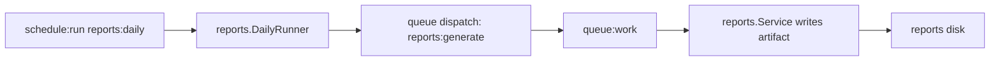

# Reports Daily Schedule

::: info Verified Scenario
We test this scenario against the current GoForj templates, including the generated files, wiring changes, commands, and verification steps.
:::

This scenario adds a `reports:daily` schedule that dispatches the existing `reports:generate` job.

The schedule decides when daily report work should begin. The queue still owns execution, retries, worker lifecycle, and failure visibility.

## What You Will Build

- `internal/reports/daily.go` selects users that need daily reports.
- `internal/schedules/scheduler_registry.go` registers a named `reports:daily` schedule.
- The schedule calls a domain-owned method instead of putting report logic in scheduler bootstrap.
- The method dispatches `reports:generate` jobs, so workers continue to process report generation.



## Prerequisites

Complete [Reports Generate Job](/scenarios/reports-generate-job) first.

The generated App should have scheduler and jobs enabled. Verify these generated packages exist:

```text
internal/schedules
internal/jobs
internal/queues
```

## Golden Path State

Before this scenario, reports are generated when the `users.created` subscriber dispatches `reports:generate`.

After this scenario, `reports:daily` can start the same report workflow on a recurring schedule. The schedule decides when work begins; the queue and workers still own execution.

## Files

This scenario edits or creates:

**Reports feature**

```text
internal/reports/daily.go
internal/reports/daily_test.go
```

**Users repository**

```text
internal/users/repository.go
```

**Scheduler**

```text
internal/schedules/scheduler.go
internal/schedules/scheduler_registry.go
```

**App wiring**

```text
app/wire/inject_services_app.go
```

## Step 1: Add A Daily Runner

Create `internal/reports/daily.go`.

The runner does not generate reports itself. It turns a recurring schedule into queued work.

Create or replace `internal/reports/daily.go`:

```go
package reports

import (
	"context"
	"fmt"
)

type DailyTarget struct {
	UserID string
	Email  string
}

type DailyTargetRepository interface {
	DueForDailyReport(ctx context.Context) ([]DailyTarget, error)
}

type DailyRunner struct {
	targets DailyTargetRepository
	reports ReportQueue
}

func NewDailyRunner(targets DailyTargetRepository, reports ReportQueue) *DailyRunner {
	return &DailyRunner{
		targets: targets,
		reports: reports,
	}
}

func (r *DailyRunner) Run(ctx context.Context) error {
	targets, err := r.targets.DueForDailyReport(ctx)
	if err != nil {
		return fmt.Errorf("load daily report targets: %w", err)
	}

	for _, target := range targets {
		if err := r.reports.Queue(ctx, target.UserID, target.Email); err != nil {
			return fmt.Errorf("queue daily report for %s: %w", target.UserID, err)
		}
	}

	return nil
}
```

## Step 2: Add Daily Targets To The Repository

Extend `MemoryUserRepository` so the schedule can ask the repository for due report targets.

Update `internal/users/repository.go` so it includes:

```go
"github.com/goforj/cache"

"your/module/internal/reports"
```

## Step 3: Implement Daily Target Lookup

Keep target selection behind the repository boundary.

Update `internal/users/repository.go` so it includes:

```go
func (r *MemoryUserRepository) Save(ctx context.Context, user User) (User, error) {
	r.mu.Lock()
	defer r.mu.Unlock()

	if user.ID == "" {
		user.ID = strconv.Itoa(r.nextID)
		r.nextID++
	}
	r.users[user.ID] = user
	return user, nil
}

func (r *MemoryUserRepository) DueForDailyReport(ctx context.Context) ([]reports.DailyTarget, error) {
	r.mu.Lock()
	defer r.mu.Unlock()

	targets := make([]reports.DailyTarget, 0, len(r.users))
	for _, user := range r.users {
		targets = append(targets, reports.DailyTarget{
			UserID: user.ID,
			Email:  user.Email,
		})
	}
	return targets, nil
}
```

## Step 4: Inject The Daily Runner Into Scheduler

Add the daily runner to the generated scheduler type.

Update `internal/schedules/scheduler.go` so it includes:

```go
"your/module/internal/inspects"
"your/module/internal/reports"
```

## Step 5: Add Scheduler Field

Store the injected runner on the scheduler.

Update `internal/schedules/scheduler.go` so it includes:

```go
inspectManager *inspects.Manager
dailyReports   *reports.DailyRunner
```

## Step 6: Add Scheduler Constructor Parameter

Wire can now provide the runner to the scheduler.

Update `internal/schedules/scheduler.go` so it includes:

```go
inspectManager *inspects.Manager,
dailyReports *reports.DailyRunner,
```

## Step 7: Assign Scheduler Runner

Preserve the generated scheduler wiring and add the new field assignment.

Update `internal/schedules/scheduler.go` so it includes:

```go
inspectManager: inspectManager,
dailyReports:   dailyReports,
```

## Step 8: Register The Schedule

Keep the registry declarative. The registry names the schedule and points to the domain-owned method.

Update `internal/schedules/scheduler_registry.go` so it includes:

```go
s.registerJobObservers()

s.DailyAt("04:00").
        Name("reports:daily").
        Do(s.inspectTask("reports:daily", s.dailyReports.Run))
```

## Step 9: Wire The Runner

Bind the existing report job to the small queueing interface and bind the user repository to daily target lookup.

Update `app/wire/inject_services_app.go` so it includes:

```go
reports.NewService,
reports.NewDailyRunner,
wire.Bind(new(reports.DailyTargetRepository), new(*users.MemoryUserRepository)),
```

## Step 10: Test The Runner

Create `internal/reports/daily_test.go`.

The unit test proves schedule target behavior without waiting for the scheduler runtime.

Create or replace `internal/reports/daily_test.go`:

```go
package reports

import (
	"context"
	"testing"
)

type fakeDailyTargets struct {
	targets []DailyTarget
}

func (f fakeDailyTargets) DueForDailyReport(context.Context) ([]DailyTarget, error) {
	return f.targets, nil
}

type fakeReportQueue struct {
	queued []DailyTarget
}

func (f *fakeReportQueue) Queue(_ context.Context, userID string, email string) error {
	f.queued = append(f.queued, DailyTarget{UserID: userID, Email: email})
	return nil
}

func TestDailyRunnerQueuesReports(t *testing.T) {
	queue := &fakeReportQueue{}
	runner := NewDailyRunner(
		fakeDailyTargets{targets: []DailyTarget{{UserID: "42", Email: "ada@example.test"}}},
		queue,
	)

	if err := runner.Run(context.Background()); err != nil {
		t.Fatalf("run daily reports: %v", err)
	}
	if len(queue.queued) != 1 {
		t.Fatalf("queued reports = %d", len(queue.queued))
	}
}
```

## Build and Verify

```bash
forj build
```

```bash
go test ./...
```

## Verify The Schedule

Start a worker in one terminal:

```bash
forj worker
```

Start the scheduler in another terminal:

```bash
forj scheduler
```

For a fast local check, temporarily use a short interval while developing:

```go
s.Every(30).Seconds().
  Name("reports:daily").
  Do(s.inspectTask("reports:daily", s.dailyReports.Run))
```

Return to `DailyAt("04:00")` before treating the schedule as production-shaped.

## Operations

Operational notes:

- Run scheduler processes explicitly with `./bin/app scheduler`.
- Keep the scheduler singleton unless your locking strategy supports more than one scheduler process.
- Scale workers separately with `./bin/app worker`.

## Common Mistakes

::: warning Common mistakes
- Do not duplicate report generation logic in the scheduler registry.
- Do not use an anonymous callback for `reports:daily`.
- Do not treat a schedule as a durable queue.
- Do not run multiple scheduler processes unless overlap and locking behavior are intentional.
- Do not skip the worker process; the schedule dispatches jobs, and workers perform the work.
:::

## Next Steps

- Next, follow the full API, event, job, schedule, metrics, inspects, Lighthouse, and log path in [Runtime Observability](/scenarios/runtime-observability).
