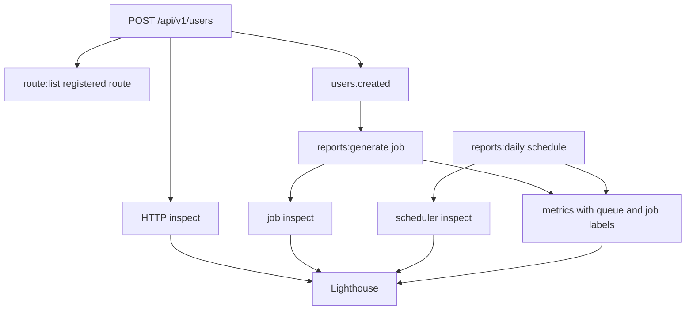

# Runtime Observability

This scenario follows the same application behavior through the surfaces operators use to trust a running App.

The goal is not to add new business behavior. The goal is to prove that HTTP requests, events, jobs, schedules, metrics, inspects, Lighthouse, and logs all describe the same runtime story.

## What You Will Observe

- `route:list` shows the HTTP surface.
- API logs show request and lifecycle behavior.
- Metrics expose bounded labels for routes, jobs, queues, and schedules.
- Inspects capture request, job, scheduler, and CLI execution records.
- Lighthouse provides a first-party operator view over recent runtime state.



## Prerequisites

Complete these scenarios first:

1. [JSON API Route](/scenarios/json-api-route)
2. [Cached User Profile](/scenarios/cached-user-profile)
3. [Users Created Event](/scenarios/users-created-event)
4. [Reports Generate Job](/scenarios/reports-generate-job)
5. [Reports Daily Schedule](/scenarios/reports-daily-schedule)

Enable metrics and Lighthouse when creating or configuring the App.

## Step 1: Confirm Routes

List the registered routes:

```bash
forj run route:list
```

Expected route evidence:

```text
POST /api/v1/users
GET  /-/health
GET  /-/ready
```

Use `route:list` as the HTTP source of truth. Startup logs are useful, but the route list is the complete route surface.

## Step 2: Start Runtime Processes

Use separate terminals so each runtime boundary stays visible.

Start the API:

```bash
forj run api
```

Start workers:

```bash
forj run worker
```

Start the scheduler:

```bash
forj run scheduler
```

In production, use the built binary equivalents:

```bash
./bin/app api
./bin/app worker
./bin/app scheduler
```

## Step 3: Trigger The Workflow

Create a user:

```bash
curl -X POST http://localhost:3000/api/v1/users \
  -H 'Content-Type: application/json' \
  -d '{"name":"Grace Hopper","email":"grace@example.test"}'
```

Expected behavior:

- the API handles `POST /api/v1/users`
- the service publishes `users.created`
- the subscriber dispatches `reports:generate`
- the worker processes `reports:generate`
- storage receives a report artifact

## Step 4: Check Metrics

Check the shared local metrics endpoint:

```bash
curl http://localhost:9100/metrics
```

When split runtime commands expose source-specific listeners, also check:

```bash
curl http://localhost:9101/metrics
curl http://localhost:9102/metrics
```

Look for bounded labels such as route name or pattern, queue name, job name, schedule name, source, and status. Do not expect user IDs, emails, raw URLs, or storage filenames to appear as labels.

Useful evidence includes:

```text
route="/api/v1/users"
job_name="reports:generate"
schedule_name="reports:daily"
queue="default"
source="jobs"
source="scheduler"
```

Metric names can evolve with the metrics package and generated App version. The content that must remain stable is the label discipline: bounded operational names, not user-controlled data.

## Step 5: Check Inspects

Open Lighthouse and inspect recent executions.

Look for records from:

- HTTP request handling
- queued job processing
- scheduler runs
- CLI commands such as `route:list`

Each inspect should tell a bounded execution story: source runtime, duration, status, timeline events, and safe payload details where enabled.

Use `inspect` for the product surface. `trace_id` may still appear as a correlation field in logs or payloads.

## Step 6: Check Logs

Use logs to confirm lifecycle and failure behavior:

```bash
forj run api
forj run worker
forj run scheduler
```

Good logs should answer:

- which runtime started
- which runtime is shutting down
- whether optional resources degraded
- whether a job or schedule failed
- which bounded runtime identity emitted the line

Logs should not be the only way to discover registered routes, queue depth, or scheduler state. Use route lists, metrics, inspects, and Lighthouse for those surfaces.

## Step 7: Follow The Schedule

Run the scheduler with the temporary short interval from [Reports Daily Schedule](/scenarios/reports-daily-schedule) when testing locally.

Expected evidence:

- scheduler logs show `reports:daily`
- scheduler metrics include the schedule name
- a scheduler inspect is retained by Lighthouse
- workers process one or more `reports:generate` jobs
- job metrics and job inspects use `reports:generate`

This proves the schedule dispatches durable work instead of performing report generation inside scheduler bootstrap.

## Troubleshooting

If no route appears, run `forj build` and then `forj run route:list`.

If no job is processed, confirm the API and worker processes use a shared queue backend. `workerpool` is process-local; use SQLite or another shared backend when API and worker run separately.

If metrics are empty, confirm metrics were enabled for the surface you are checking:

```text
METRICS_HTTP_ENABLED=true
METRICS_QUEUE_ENABLED=true
METRICS_EVENTS_ENABLED=true
METRICS_SCHEDULER_ENABLED=true
```

If Lighthouse has no inspect records, confirm Lighthouse is enabled and the inspect buffer is not saturated.

## Common Mistakes

::: warning Common mistakes
- Do not use metrics labels for user IDs, emails, raw paths, request IDs, or filenames.
- Do not treat Lighthouse as the only observability surface.
- Do not call inspects traces in user-facing docs.
- Do not rely on startup logs as the route source of truth.
- Do not hide worker or scheduler startup inside constructors.
:::

## Next Steps

- [Metrics](/operations/metrics) explains metric endpoints and label rules.
- [Inspects](/operations/inspects) explains execution records.
- [Lighthouse](/operations/lighthouse) explains the operator surface.
- [Production Checklist](/operations/production-checklist) collects production readiness checks.
