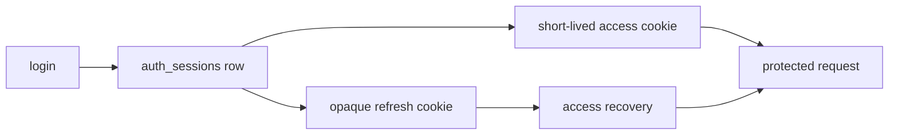

# Sessions and Cookies

Generated Auth uses short-lived access JWTs and opaque refresh secrets inside `HttpOnly` cookies, anchored to server-side session rows.

The browser carries credentials, but the database session remains authoritative.

## Session Flow

The access token contains user and session identity. It does not replace the persisted session check.

The refresh cookie contains `sessionID.secret`. Only a hash of the secret is stored.

## Expiry Policy

Default policy:

| Setting | Default | Meaning |
| --- | --- | --- |
| `AUTH_ACCESS_TOKEN_TTL` | `15m` | Access JWT lifetime. |
| `AUTH_SESSION_IDLE_TTL` | `2h` | Maximum session inactivity. |
| `AUTH_SESSION_TTL` | `24h` | Normal absolute session lifetime. |
| `AUTH_REMEMBER_SESSION_TTL` | `720h` | Remembered absolute session lifetime. |

The earliest applicable expiry wins. A valid access JWT cannot revive an expired, revoked, or idle session.

## Refresh Behavior

Protected middleware can recover from a missing or expired access cookie using the current refresh secret. That recovery reissues access state without rotating the refresh secret.

Explicit `POST /api/v1/auth/refresh` rotates the refresh secret and updates `refresh_rotated_at`.

Keeping normal middleware recovery separate from explicit rotation prevents concurrent browser requests at the access-token boundary from repeatedly invalidating each other.

## Revocation

Generated routes support:

- current-session logout
- logout from all sessions
- session listing
- revoking one owned session
- revoking other sessions after a password change
- revoking sessions after a password reset

Logout and current-session revoke own cookie clearing. An unrelated protected-request `401` does not clear cookies because it may race with newer valid browser state.

## Cookie Policy

Generated auth cookies use:

- `HttpOnly: true`
- `SameSite: Lax`
- `Secure` from `AUTH_COOKIE_SECURE`
- optional domain scope from `AUTH_COOKIE_DOMAIN`

Use `AUTH_COOKIE_SECURE=true` behind production HTTPS. `auto` is useful when the same generated App must support plain-HTTP local development and HTTPS deployment.

Keep cookie scope as narrow as the product permits. Broad parent-domain cookies increase the number of hosts that participate in the security boundary.

## CSRF Boundary

`SameSite=Lax` reduces common cross-site cookie submission, but it is not a complete substitute for request policy.

For browser-authenticated state-changing routes:

- use non-safe HTTP methods
- validate allowed origins where cross-origin traffic is possible
- add CSRF middleware when the deployment accepts cross-site forms or embeds
- keep CORS credentials and allowed origins explicit
- do not expose mutation behavior through `GET`

Apply CSRF policy at route or router composition through `webmiddleware`; do not scatter token validation through business services.

## Client Rules

Browser clients should:

- send requests with cookie credentials when crossing origins intentionally
- treat `401` as an authentication result, not a reason to mutate cookies directly
- avoid storing access or refresh values in local storage
- use session-list and revoke routes for user-visible session controls

## Common Mistakes

::: warning Common mistakes
- Do not trust a JWT after its session row is revoked or expired.
- Do not persist raw refresh secrets.
- Do not rotate refresh secrets from every concurrent protected request.
- Do not clear cookies from arbitrary middleware failures.
- Do not rely on CORS as CSRF protection.
:::

## Next Steps

- [Auth](/security/auth) describes the full generated component.
- [OAuth](/security/oauth) explains provider-backed login and linking.
- [Production Hardening](/security/production-hardening) covers deployment policy.
- [Middleware](/applications/middleware) explains HTTP middleware placement.
