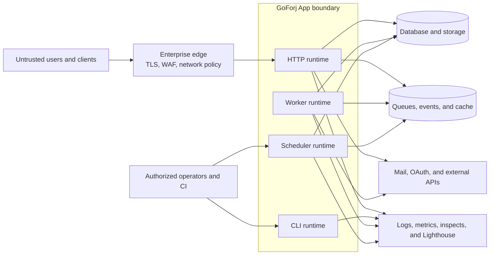

# Threat Model

This reference threat model describes the GoForj framework, first-party
libraries, generated source, and normal App runtime boundaries. It
helps an enterprise decide what GoForj establishes and what must be assessed in
the application and deployment that use it.

It is not a substitute for an application-specific threat model. Adopters must
extend it with their users, data classifications, authorization rules, network
topology, infrastructure providers, and abuse cases.

## Scope and Assumptions

This model covers:

- source and dependency intake from the repositories in [Repository
  Coverage](/security/repository-coverage)
- the `forj` generator, templates, build path, and application source produced
  by the generator
- HTTP, CLI, worker, and scheduler runtimes in a GoForj app
- first-party cache, events, mail, metrics, queue, storage, and web libraries
- generated Auth, session, OAuth, diagnostics, and observability behavior

The model assumes that the adopting organization:

- reviews and pins the exact GoForj versions it accepts
- owns generated source after creation and reviews regeneration changes
- builds in a controlled environment from reviewed source
- supplies production identity, secrets, network, data, and deployment policy
- restricts infrastructure credentials and services to the runtimes that need
  them

Application authorization, tenant isolation, business-logic abuse, production
configuration, and operator access are outside GoForj's direct control.

## Protected Assets

| Asset | Security Objective |
| --- | --- |
| Application source and generated code | Only reviewed changes enter a build, and regeneration does not silently replace application policy. |
| Build inputs and artifacts | Dependencies, workflows, and build outputs correspond to the approved revision. |
| Credentials and cryptographic keys | Secrets remain outside source, logs, inspects, metrics, and browser-readable storage. |
| User identity and sessions | Authentication state cannot be forged, replayed indefinitely, or retained after server-side revocation. |
| Business and customer data | Reads and mutations follow application authorization, integrity, retention, and recovery policy. |
| Infrastructure resources | Databases, queues, caches, storage, mail, and identity providers accept only intended operations from intended runtimes. |
| Operational evidence | Logs, metrics, inspects, health responses, and security findings are accurate, bounded, and appropriately protected. |

## Trust Boundaries

The diagram separates traffic controlled by the adopter from GoForj app
runtimes and the external systems selected through drivers. An arrow means data
or control crosses a boundary that must be authenticated, validated, or
restricted.



GoForj defines contracts, generated defaults, and runtime behavior inside the
App boundary. The adopting organization owns the enterprise edge, workload
identity, network routes, provider configuration, production data stores, and
access to operational evidence.

The source and build path is a separate trust boundary:

```text
GoForj source and dependencies
            |
            v
reviewed application source -> controlled build -> promoted artifact
            |                       |                    |
       source approval          build identity      deployment policy
```

Repository CI provides source, dependency, and SBOM evidence. The adopting
organization remains responsible for reproducing or approving the build,
signing the deployable artifact when required, and controlling promotion.

## Threat Scenarios and Controls

| Threat Scenario | GoForj Control or Design | Adopter Control and Residual Risk |
| --- | --- | --- |
| A compromised or vulnerable dependency enters source | Dependency Review gates pull-request deltas; Dependabot proposes updates; govulncheck and npm audit scan resolved inputs; CycloneDX SBOMs inventory discovered manifests. | Approve exact versions, retain the reviewed inventory, use internal advisory sources when required, and deploy fixes. Unknown and private vulnerabilities remain possible. |
| A nested module, lockfile, fixture, or generated dependency escapes scanning | Security workflows discover manifests and compare them with scan, SBOM, and update configuration. Applicable multi-module repositories submit resolved dependency snapshots to prevent obsolete module history from becoming the active dependency graph. | Confirm adopted repositories and application-owned manifests remain covered. Files produced or downloaded outside the reviewed build can escape repository scanning. |
| Malicious source or workflow code changes the build | Pull requests run tests and security checks; CodeQL analyzes enrolled source; workflow actions use immutable commit references and narrow permissions. | Enforce reviews, required checks, protected branches, trusted runners, least-privilege tokens, and artifact promotion. Public repository files cannot prove organization settings or runner integrity. |
| Generated code introduces an unsafe default or overwrites application policy | Templates are reviewed source, generated output is committed and readable, and framework validation exercises rendered applications and generated asset inventory. | Review generated diffs and application overrides. Generation cannot determine business authorization or organization-specific security requirements. |
| Untrusted HTTP input causes injection, traversal, unsafe redirects, or request smuggling | Web contracts, request validation, path handling, redirect safety, middleware boundaries, and driver tests reduce common implementation errors. Static analysis and tests cover represented cases. | Validate domain input, parameterize data access, restrict upload and storage paths, configure trusted proxies, and test the deployed edge. Novel parser differences and application logic flaws remain possible. |
| An attacker takes over or retains an authenticated session | Generated Auth uses short-lived access JWTs, opaque hashed refresh secrets, server-authoritative session rows, rotation, revocation, rate limits, and lockout. OAuth uses state, PKCE, nonce, single-use records, and explicit identity linking. | Set deployment secrets and cookie policy, configure HTTPS and CSRF controls, choose session lifetimes, protect recovery channels, and monitor abuse. Custom auth or routes can bypass generated protections. |
| An authenticated user accesses another user's or tenant's data | GoForj keeps dependencies and route middleware explicit but does not invent application authorization rules. | Define and test object-level, function-level, role, and tenant authorization on every operation. This is a primary application-owned residual risk. |
| Browser credentials are abused through CSRF, CORS, or an open redirect | Auth cookies are `HttpOnly`, host-scoped, and `SameSite=Lax`; redirect targets are sanitized; production guidance requires secure cookies and explicit credentialed origins. | Terminate HTTPS, set `AUTH_COOKIE_SECURE=true`, apply CSRF policy where needed, and allow only intended origins and redirects. Deployment policy determines the final browser boundary. |
| Secrets or personal data leak through source or diagnostics | Full-history Gitleaks detects known secret patterns; generated environment examples redact secret-like values; auth diagnostics use allowlisted fields; guidance forbids tokens and unbounded sensitive payloads in logs, metrics, and inspects. | Use a secrets manager, rotate credentials, restrict and retain telemetry appropriately, and review application logging. Pattern scanners cannot find every secret or external leak. |
| Outbound requests, commands, mail, or storage access cross an unintended boundary | `httpx`, `execx`, `mail`, and `storage` isolate these capabilities behind explicit calls and drivers; security fixes cover redirect, timeout, path, deletion, and permission boundaries. | Restrict destinations, executable inputs, filesystem roots, provider scopes, egress, and credentials. Application-provided URLs, commands, and paths still require domain validation. |
| Forged, duplicated, delayed, or malformed asynchronous work changes state | Queue and event contracts use named handlers and typed payloads; worker lifecycle, retry, timeout, and driver behavior are tested. | Authenticate broker access, validate payloads, make retryable handlers idempotent, define dead-letter and replay policy, and separate sensitive queues. Exactly-once business effects are not guaranteed by a transport abstraction. |
| Resource exhaustion degrades availability | Context cancellation, timeouts, bounded telemetry guidance, worker controls, health checks, and rate limiting provide control points. | Set edge limits, request and payload bounds, concurrency, quotas, queue depth alerts, capacity, and autoscaling. GoForj does not select safe limits for an application's workload. |
| Diagnostics expose internals or create misleading evidence | Detailed readiness can require a diagnostic token; guidance keeps metrics and Lighthouse on trusted networks; labels and captures should be bounded and redacted. | Protect endpoints, control operator access, set retention, detect collection failure, and forward evidence to an approved system. Local diagnostics are not an audit log by default. |
| Data is lost, corrupted, or restored incorrectly | Storage and database boundaries are explicit; lifecycle and graceful shutdown behavior is tested; production guidance requires backups and restore testing. | Own encryption, replication, backup, restore, retention, migration, and disaster recovery. Cache and events must not be treated as durable source-of-truth storage. |

## Security Ownership

| GoForj Owns | The Adopting Organization Owns |
| --- | --- |
| Framework and first-party library source | Application business logic and authorization |
| Generator and template behavior | Review and ownership of generated source |
| Published security workflows and repository evidence | Branch, runner, token, and source-intake governance |
| Generated Auth and session defaults | Identity policy, recovery assurance, and provider configuration |
| Driver contracts and first-party integration tests | Infrastructure selection, credentials, network access, and service configuration |
| Vulnerability reporting and release guidance | Internal triage, deployment, exception approval, and incident response |

## Residual Risks

The following risks must remain visible in an enterprise decision:

- automated analysis cannot prove the absence of unknown vulnerabilities or
  business-logic flaws
- CI SBOM artifacts are not signed release attestations
- release tags and public source do not prove the identity or integrity of an
  enterprise's deployable artifact
- GoForj does not provide application authorization, tenant isolation, data
  classification, or regulatory compliance by itself
- third-party drivers, infrastructure services, identity providers, and
  frontend dependencies retain their own security boundaries
- organization settings, production access, response exercises, and deployment
  controls require separate evidence

Record accepted residual risks with an owner, rationale, mitigation, expiry or
review date, and the exact version or deployment they cover.

## Review and Evidence

Review this model when GoForj adds a runtime, generated component, external
provider, credential type, build channel, or new repository to the assurance
scope. An adopting team should also review it after architecture, data-flow,
identity, network, or deployment changes.

Use these pages to assemble evidence:

- [Security Assurance](/security/assurance) for the review entry point
- [Security Controls](/security/controls) for control intent and limitations
- [Repository Coverage](/security/repository-coverage) for the assessed source
  estate
- [Vulnerability Management](/security/vulnerability-management) for response
  and remediation policy
- [Enterprise Assessment](/security/enterprise-assessment) for the application
  and deployment evidence checklist
- [Production Hardening](/security/production-hardening) for deployment review
